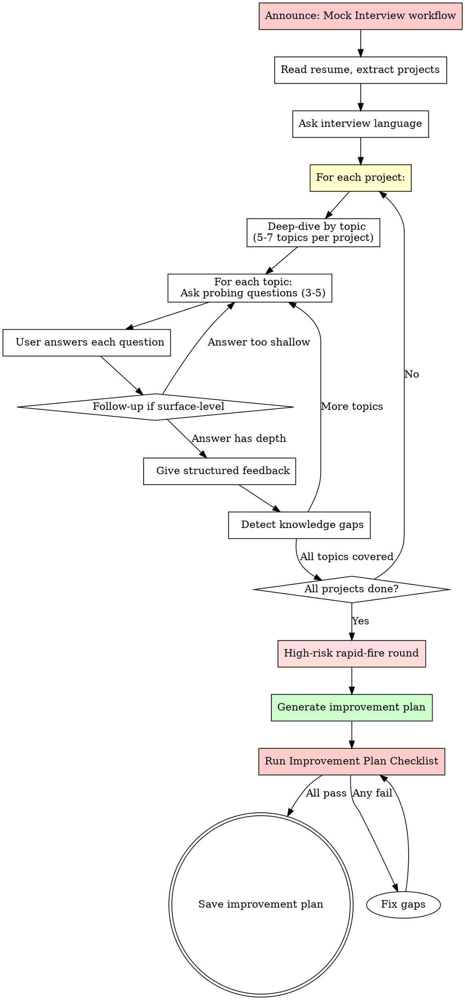

# Mock Interview Workflow

## Overview

Conduct project-by-project deep-dive interviews based on the user's resume, with structured feedback and improvement planning.

**Core principle:** Real technical interviews don't ask "tell me about your project." They dig into each layer — from background and role boundary, to data and training, to architecture internals, to evaluation and failure modes. Every question must be traceable to the resume. Every answer must be probed deeper.

**Violating the letter of this process is violating the spirit of this process.**

## The Iron Law

```
NO GENERIC QUESTIONS. NO SUBJECTIVE SCORES. NO SESSIONS WITHOUT IMPROVEMENT PLAN.
```

Ask generic questions not based on the resume? Restart the project.
Give a numerical score for an answer? Delete it. Use structured feedback.
End without an improvement plan? Session incomplete. Always produce one.

**No exceptions:**
- Don't ask "Tell me about yourself" or "What's your biggest weakness?"
- Don't give scores like "7/10" or "B+" — they're unreliable
- Don't skip the improvement plan "because the interview went well"
- Don't combine multiple projects in one interview round
- Don't rush through questions — each answer gets full feedback
- Don't accept surface-level answers without follow-up probing

## Process Flow



## Phase 1: Setup

### Read the Resume

Ask the user for their resume file path. Read the entire file.

**If the file doesn't exist:** Cannot proceed. Resume is the foundation for all questions.

**Extract from resume:**
- List of all projects (name, background, solution, results, tech stack)
- Work experience (role, company, duration)
- Skills listed
- **For each project, identify the deep-dive topics** (see Phase 2)

### Ask Interview Language

> "What language would you like the interview in?
> - **English** — All questions and feedback in English
> - **中文** — All questions and feedback in Chinese
> - **Mixed** — Questions in your chosen language, technical terms in English"

**Respect the user's choice throughout the entire session.** Don't switch languages mid-interview.

## Phase 2: Project-by-Project Deep Dive

### The Deep-Dive Method

Real technical interviews don't ask one question per topic and move on. They dig progressively deeper, following a structured topic progression for each project.

**For EACH project, identify 5-7 deep-dive topics** based on what the resume claims. The topic list is derived from the project's content — NOT from a generic checklist.

#### Deep-Dive Topic Progression

For each project, progress through these topic layers in order. Not every project will have all layers — skip layers that don't apply.

| Layer | Topic | Questions Probe |
|-------|-------|----------------|
| 1 | **Background & Role Boundary** | What problem does this project solve? What specifically did YOU do vs. the team? |
| 2 | **Architecture & Design Decisions** | Why this architecture? What alternatives were considered? What trade-offs? |
| 3 | **Data & Training** (for ML/AI projects) | Where did data come from? How was it labeled? How much? Train/val/test split? |
| 4 | **Technical Internals** | How does component X work internally? Why this specific design? |
| 5 | **Evaluation & Metrics** | How do you measure success? Precision/recall/F1? A/B testing? Bad Case analysis? |
| 6 | **Failure Modes & Improvement** | What went wrong? What Bad Cases did you encounter? How did you fix them? |
| 7 | **Elevator Pitch** | Can you explain the complete chain in 2 minutes? |

#### Question Generation per Topic

For each topic, generate 3-5 questions that probe progressively deeper:

**Level 1 — Comprehension:** "What does X do?" / "How does X work?"
**Level 2 — Reasoning:** "Why did you choose X over Y?" / "What would happen if X failed?"
**Level 3 — Self-awareness:** "What would you do differently?" / "What don't you know about this?"

**Red Flags — STOP and Regenerate:**
- Questions that could apply to any project ("Tell me about your project")
- Questions about technologies NOT mentioned in the resume
- Generic behavioral questions ("What's your biggest weakness?")
- Only asking Level 1 questions (comprehension) without deeper probing
- Questions about topics the user has no way to know from their resume

### The Follow-Up Rule

**When a user gives a surface-level answer, you MUST follow up.** Do not accept shallow answers and move on.

**Surface-level answer signals:**
- Answer only describes WHAT was done, not WHY or HOW
- Answer uses vague terms ("we used optimization") without specifics
- Answer avoids numbers ("it improved performance") without quantification
- Answer deflects ("the team handled that") without personal contribution
- Answer is "不清楚" / "not sure" / "I don't remember"

**Follow-up patterns:**
| Surface Answer | Follow-Up Probe |
|---------------|-----------------|
| "We used LoRA for fine-tuning" | "What rank did you use? Why? Which layers did you attach LoRA to?" |
| "It improved accuracy" | "From what to what? How was accuracy defined? On what test set?" |
| "The team built an Agent system" | "What specifically did YOU build? What was your role boundary?" |
| "Not sure about that detail" | Mark as knowledge gap. Continue to next question. Don't linger. |
| "We did data cleaning" | "What exactly did you clean? Deduplication? Quality filtering? How?" |

### Interview Format

**Ask ONE question at a time.** Wait for the user's answer before proceeding.

> **Project: [Name] — Topic: [Topic Name] — Question [X/Y]**
>
> [Question]
>
> Take your time answering. When you're ready, type your response.

**After the user answers, give structured feedback:**

```markdown
**Reference Answer**: [A strong answer demonstrating the expected depth and structure.
This is NOT what the user "should have said" word-for-word — it shows the level
of specificity, technical reasoning, and self-awareness expected. Include specific
numbers, design rationale, and awareness of alternatives and limitations.]

**Improvement Suggestions**: [Specific, actionable points about what was missing
or could be stronger. Reference concrete techniques, concepts, or frameworks.
Point out where the answer stayed at surface level and what deeper layer to reach.]

**Knowledge Gaps**: [If the answer revealed fundamental knowledge gaps, list them
with recommended learning resources. If no gaps, say "No significant gaps detected."]
```

### Knowledge Gap Detection

When a user says "不清楚" / "not sure" / "I don't remember" / gives a clearly wrong answer, **mark it as a knowledge gap immediately.** These gaps are critical for the improvement plan.

**Gap detection signals:**
| Signal | What It Reveals | How to Follow Up |
|--------|----------------|-----------------|
| "不清楚" / "I'm not sure" | Surface-level understanding without deep knowledge | Mark gap, provide brief explanation, move on |
| Confident but wrong answer | Misconception — dangerous in interviews | Gently correct, mark as priority gap |
| Vague without specifics | Used the technology but doesn't understand internals | Ask "how does it work internally?" to confirm depth |
| "The team handled that" | Unclear role boundary — interviewers will probe this | Ask "what was YOUR specific contribution?" |
| Can explain WHAT but not WHY | Implementation without reasoning — red flag for senior roles | Ask "why this approach and not alternatives?" |
| No awareness of alternatives | Single-solution thinking | Ask "what other approaches exist for this problem?" |

## Phase 3: High-Risk Rapid-Fire Round

**After all projects are deep-dived, conduct a rapid-fire round covering cross-cutting concerns.**

This round simulates the "rapid follow-up" style of real technical interviews where interviewers quickly test knowledge breadth and catch inconsistencies.

### Rapid-Fire Categories

Pick questions from categories relevant to the user's resume claims:

1. **Training details** — "How many cards? What batch size? What learning rate? bf16 or fp16? Why?"
2. **Evaluation rigor** — "How do you define your metrics? Test set size? Who labeled it? Precision or recall more important?"
3. **Bad Case handling** — "Give me 3 real Bad Cases. How did you fix each? Which module was the problem?"
4. **Ablation evidence** — "How do you prove LoRA/RAG/prompt helped vs. base model? Did you do ablation?"
5. **Architecture limits** — "What would break if scale increased 10x? What are the current bottlenecks?"

**Format:** Ask 5-8 rapid-fire questions, one after another. Brief feedback only — mark gaps for the improvement plan.

## Phase 4: Improvement Plan

**This is MANDATORY.** No session ends without one.

### Plan Format

```markdown
# Interview Improvement Plan

## Summary
[Brief overall assessment — 2-3 sentences about strengths and areas for growth]

## Analysis by Dimension

| Dimension | Strong Areas | Growth Areas |
|-----------|-------------|--------------|
| Background & Role | [Can clearly articulate project context and personal contribution] | [Specific weaknesses] |
| Architecture & Design | [Specific strengths] | [Specific weaknesses] |
| Data & Training | [Specific strengths] | [Specific weaknesses] |
| Technical Internals | [Specific strengths] | [Specific weaknesses] |
| Evaluation & Metrics | [Specific strengths] | [Specific weaknesses] |
| Failure Modes | [Specific strengths] | [Specific weaknesses] |
| Elevator Pitch | [Can explain each project clearly in 2 minutes] | [Specific weaknesses] |

## Knowledge Gap Checklist

- [ ] **[Gap 1]** — [What was unclear/wrong] → [Recommended resource to close the gap]
- [ ] **[Gap 2]** — [What was unclear/wrong] → [Recommended resource]
- [ ] **[Gap 3]** — [What was unclear/wrong] → [Recommended resource]

## Per-Project Deep-Dive Summary

### [Project 1 Name]
- **Topics covered:** [List which deep-dive topics were covered]
- **Strengths:** [What went well — specific to this project]
- **Areas to improve:** [What to work on — specific to this project]
- **Must-prepare evidence:** [Specific items the candidate should prepare before real interviews]

### [Project 2 Name]
- [Same structure]

## Next Steps

1. **[Most impactful improvement]** — [Specific action with timeline suggestion]
2. **[Second most impactful]** — [Specific action with timeline suggestion]
3. **[Third most impactful]** — [Specific action with timeline suggestion]

## "Must-Prepare Evidence" Checklist
[Based on the deep-dive, list specific artifacts the candidate should prepare:]
- [ ] Training configuration table for [project]
- [ ] Dataset statistics table for [project]
- [ ] Evaluation metrics definition table for [project]
- [ ] 3 real Bad Cases for [project]
- [ ] Ablation comparison: prompt only vs. prompt+RAG vs. SFT/LoRA vs. full pipeline
- [ ] 2-minute pitch for each project, practiced until fluent
```

### Ask to Save

> "Your improvement plan is ready. Would you like me to save it? If so, where should I save the file?"

## Phase 5: Improvement Plan Checklist

**Before saving the improvement plan, verify EVERY item:**

- [ ] Every project from the resume was deep-dived (not just surface questions)
- [ ] Each project covered at least 3 deep-dive topics from the progression
- [ ] Surface-level answers were followed up with deeper probes
- [ ] Every answer received structured feedback (reference answer + improvement + gaps)
- [ ] Knowledge gaps were detected and marked during the interview (not only at the end)
- [ ] Rapid-fire round was conducted covering cross-cutting concerns
- [ ] "Must-prepare evidence" items are specific and actionable
- [ ] Per-project notes identify both strengths AND areas to improve
- [ ] The improvement plan is in the user's chosen language
- [ ] No subjective scores or ratings were given anywhere in the session

**Any item fails? Fix it before saving. No exceptions.**

## Common Rationalizations

| Excuse | Reality |
|--------|---------|
| "I'll give them a score like 7/10" | Scores are unreliable and unactionable. Use structured feedback. |
| "Generic questions are fine for practice" | Generic practice doesn't prepare for real interviews. Use resume-specific deep-dives. |
| "I'll ask all questions at once" | Overwhelming. One at a time. Probe deeper on surface answers. |
| "The improvement plan isn't necessary for strong candidates" | Every candidate has gaps. The plan IS the value of mock interviews. |
| "I can skip the rapid-fire round" | Rapid-fire catches inconsistencies that deep-dives miss. Never skip. |
| "I'll just list the gaps, no need for resources" | Gaps without resources are complaints, not help. Always recommend how to close them. |
| "One project is enough for a session" | Real interviews cover all projects. Complete the full session or explicitly ask if the user wants to stop. |
| "Their answer was good enough, no need to probe deeper" | "Good enough" in practice ≠ "good enough" in an interview. Follow up until depth is demonstrated. |
| "They said 'not sure', I'll just move on" | Knowledge gaps MUST be marked. They're the most valuable output of the session. |
| "I don't need to ask about their specific role boundary" | Interviewers always probe "what did YOU do vs. the team." Always ask. |
