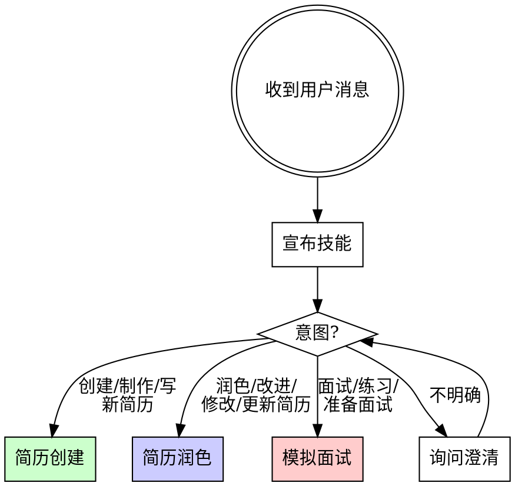

# 求职技能

<EXTREMELY-IMPORTANT>
如果此技能适用于你的任务，你必须严格遵守。这不是可选的。这不是可以商量的。你不能找借口绕过它。

如果你觉得"这个足够简单，可以跳过流程"——恰恰是你最需要流程的时候。
</EXTREMELY-IMPORTANT>

## 概述

**每个求职任务都通过此技能流转。** 简历创建、简历润色、模拟面试——每个流程都有严格的迭代工作流，杜绝捷径。

**核心原则：** 迭代胜过一次性输出。每个交付物都必须经过用户审核。没有中间检查点就没有最终产品。

**违反规则的字面意思就是违反规则的精神。**

## 铁律

```
禁止一次性输出最终结果。禁止跳过用户审核。禁止泛泛而谈的内容。
```

未经迭代就生成完整简历？重做。
跳过项目分析就编造描述？删掉。重做。
给出模糊、不具体的面试反馈？重写。每次都要重写。

**无例外：**
- 不要"节省时间"而跳过迭代
- 不要在第一轮就输出最终结果
- 不要用泛泛的内容代替对实际项目的分析
- 不要在面试中给出主观评分——只给结构化反馈

## 流程分发



### 宣布（承诺原则）

**你必须在开始时宣布：**

> "正在使用求职技能 —— [工作流名称] 流程"

这创建了公开承诺。跳过它 = 跳过问责。

### 意图检测

将用户意图匹配到对应工作流：

| 用户说的 | 工作流 | 子文件 |
|-----------|----------|----------|
| "创建/制作/写简历"、"帮我写简历"、从零开始 | 简历创建 | resume-creation.md |
| "润色/改进/修改/更新简历"、"让它更好"、已有简历 | 简历润色 | resume-polish.md |
| "面试练习"、"模拟面试"、"准备面试" | 模拟面试 | mock-interview.md |
| 含糊或混合 | 问一个澄清问题 | — |

**不要猜测。** 如果意图不明确，问："你是要创建新简历、改进现有简历，还是准备面试？"

## 跨工作流规则

这些规则适用于所有三个工作流。违反任何规则 = 违反此技能。

### 规则1：强制迭代

**每个交付物至少需要2轮用户审核。**

```
生成草稿 → 用户审核 → 修改 → 用户审核 → 定稿
```

每份草稿后，提供以下选项：

> **接受** — 使用当前版本继续
> **修改** — 告诉我需要改什么（我来修改）
> **重新生成** — 用不同方式重新开始这一部分

**红旗 —— 立即停止并重做：**
- 在第一次回复中就输出完整最终结果
- 不提供接受/修改/重新生成选项
- 跳过用户审核因为"看起来不错"
- 在任何审核轮次之前就说"这是你的最终简历"
- 合并多次迭代但不展示变更

### 规则2：LapisCV 格式合规

所有简历必须遵循 LapisCV Markdown 格式。完整规范见 lapiscv-template.md。

**LapisCV 不只是 Markdown 格式——它包括 CSS 样式表、字体和渲染配置。** 单独的 .md 文件无法生成正确的简历。你必须：

1. **将 LapisCV 资源复制到工作目录** —— 将 `.vscode/`、`lapis-cv/`、`template-cn.md`、`template-en.md` 从 `assets/lapis-cv-vscode-v2.0.1/` 复制到用户当前目录（平铺，不放入子目录——VS Code 使用相对路径加载 CSS）
2. **将简历 .md 文件放在 LapisCV 项目目录内**（与 `lapis-cv/styles/` 和 `lapis-cv/fonts/` 同级）
3. **导出 PDF：** 在 VS Code 中打开 .md，预览（样式自动加载），然后打印为 PDF

**必须包含的格式元素：**
- `h1` = 全名（居中）
- `blockquote` = 带图标前缀的联系方式栏
- `img alt="avatar"` = 头像照片（可选，右对齐）
- `h2` + 图标前缀 = 章节标题（教育经历、工作经验、项目经历、专业技能）
- `div alt="entry-title"` = 条目标题行（标题左，日期右）
- `---` = 必要时的分页符

**每份简历输出必须通过产品检查清单**（见 resume-creation.md）。

### 规则3：基于项目的具体性

**禁止泛泛而谈的内容。** 每个要点必须有依据：
- 实际项目代码（简历创建——AI 读取代码）
- 实际简历内容（简历润色——AI 读取现有简历）
- 实际项目经验（模拟面试——AI 根据简历提问）

| 借口 | 事实 |
|--------|---------|
| "我不读代码也能生成合理的要点" | 泛泛 = 健忘。具体 = 难忘。去读代码。 |
| "用户没有提供项目目录" | 去问。一次问一个问题。不要编造。 |
| "我加一些常见面试问题" | 问题必须来自简历中的项目。不要用通用列表。 |
| "一次迭代就够了" | 永远不够。每份专业文档都在审核中改进。 |

### 规则4：项目包装

**所有项目必须用业务视角描述，禁止学习视角。** 包装不是造假——是用业务需求视角重新描述同一个项目。

- 项目背景：用"场景 + 痛点 + 为什么需要"替代"为了学习XX"
- 个人职责：用"技术选型 + 问题 + 方案演进"替代"使用了XX技术"
- 技术难点：每个项目必须有，是面试追问的核心入口

| 借口 | 事实 |
|--------|---------|
| "项目就是学习项目，背景写'为了学习'就行" | 学习型背景会被面试官直接降级。从功能反推业务场景。 |
| "包装就是造假" | 包装改变叙事视角，不改变事实。"业务需要缓存"和"我学了Redis"描述的是同一件事。 |
| "用户没提技术难点，我就不写了" | 技术难点是面试追问入口。从代码中提取，或追问用户。 |

### 规则5：语言规则

- **简历：** 根据用户选择使用中文或英文（LapisCV 模板支持两种语言）
- **模拟面试：** 全程中文问答，不询问语言偏好。技术术语可保留英文原文
- **所有与用户的交流：** 匹配用户的语言

### 规则6：输出文件

最终简历输出是保存到用户指定路径的 `.md` 文件。**始终询问保存位置。不要假设。**

## 借口防范表

| 借口 | 事实 |
|--------|---------|
| "用户看起来很着急，我快速输出最终结果" | 匆忙的输出 = 糟糕的输出。迭代是不可协商的。 |
| "这个简历部分很简单，不需要迭代" | 简单的部分也受益于审核。每个部分都要。 |
| "我不读代码也能写出好的项目描述" | 你不能。你会写出泛泛的废话。去读代码。 |
| "用户说'直接修'，他们不想审核" | "直接修"意味着改进它，不是跳过审核。展示变更。 |
| "我给这个回答打7/10分" | 主观评分不可靠。使用结构化反馈。 |
| "通用面试问题练习也行" | 通用练习浪费时间。基于项目的练习才有效。 |
| "我只写 Markdown，他们之后可以自己设置 LapisCV" | 没有 CSS/字体的单独 .md 无法正确渲染。先复制资源。 |
| "项目就是学习项目，背景写'为了学习'也行" | 学习型背景会被面试官降级。从技术功能反推业务场景。 |
| "包装简历就是教人造假" | 包装改变叙事视角，不改变事实。"业务需要缓存"≠编造，"我学了Redis"才是问题。 |

## 参考文件

仅在对应工作流分发时加载子文件：

| 文件 | 何时加载 |
|------|-------------|
| resume-creation.md | 简历创建工作流分发时 |
| resume-polish.md | 简历润色工作流分发时 |
| mock-interview.md | 模拟面试工作流分发时 |
| lapiscv-template.md | 任何简历输出（创建或润色） |
| interview-question-bank.md | 模拟面试工作流分发时 |
| assets/lapis-cv-vscode-v2.0.1/ | 在任何简历输出之前复制到工作目录 |

**不要在启动时加载所有文件。** 渐进式披露节省上下文。
