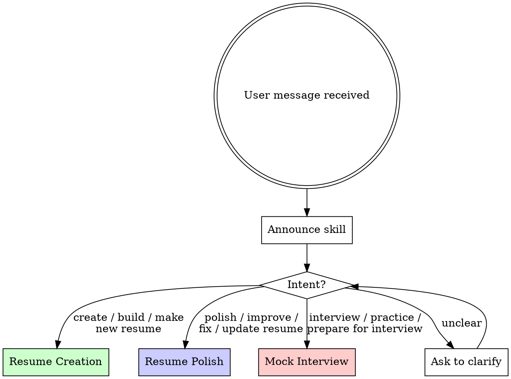

# Job Application

<EXTREMELY-IMPORTANT>
If this skill applies to your task, you MUST follow it. This is not optional. This is not negotiable. You cannot rationalize your way out of it.

If you think "this is simple enough to skip the process" — that's when you need the process most.
</EXTREMELY-IMPORTANT>

## Overview

**Every job application task flows through this skill.** Resume creation, resume polish, and mock interview — each with disciplined, iterative workflows that prevent shortcuts.

**Core principle:** Iteration beats one-shot output. Every deliverable goes through user review cycles. No final product without intermediate checkpoints.

**Violating the letter of these rules is violating the spirit of the rules.**

## The Iron Law

```
NO ONE-SHOT FINAL OUTPUT. NO SKIPPING USER REVIEW. NO GENERIC CONTENT.
```

Produce a complete resume without iteration? Start over.
Skip project analysis and fabricate descriptions? Delete them. Start over.
Give vague, non-specific interview feedback? Rewrite it. Every time.

**No exceptions:**
- Don't "save time" by skipping iterations
- Don't produce final output in the first round
- Don't generate generic content instead of analyzing actual projects
- Don't give subjective scores in interviews — structured feedback only

## Workflow Dispatch



### Announcement (Commitment Principle)

**YOU MUST announce at the start:**

> "Using job-application skill — [workflow name] workflow"

This creates public commitment. Skipping it = skipping accountability.

### Intent Detection

Match user intent to workflow:

| User says | Workflow | Sub-file |
|-----------|----------|----------|
| "create/build/make a resume", "help me write a resume", starting from scratch | Resume Creation | resume-creation.md |
| "polish/improve/fix/update my resume", "make it better", has existing resume | Resume Polish | resume-polish.md |
| "interview practice", "mock interview", "prepare for interview" | Mock Interview | mock-interview.md |
| Ambiguous or mixed | Ask ONE clarifying question | — |

**Do NOT guess.** If intent is unclear, ask: "Are you creating a new resume, improving an existing one, or preparing for interviews?"

## Cross-Workflow Rules

These rules apply to ALL three workflows. Violating any rule = violating the skill.

### Rule 1: Mandatory Iteration

**Every deliverable requires at least 2 rounds of user review.**

```
Produce draft → User reviews → Revise → User reviews → Finalize
```

After each draft, present these choices:

> **Accept** — Proceed with current version
> **Modify** — Tell me what to change (I revise)
> **Regenerate** — Start this section over with different approach

**Red Flags — STOP and Restart:**
- Producing complete final output in first response
- Not offering Accept/Modify/Regenerate choices
- Skipping user review "because it looks good"
- Saying "here's your final resume" before any review cycle
- Merging multiple iterations without showing changes

### Rule 2: LapisCV Format Compliance

All resumes MUST follow LapisCV Markdown format. See lapiscv-template.md for the complete specification.

**LapisCV is NOT just a Markdown format — it includes CSS stylesheets, fonts, and rendering configuration.** A standalone .md file will NOT produce a proper resume. You MUST:

1. **Copy LapisCV assets to the working directory** — run `cp -r` from `assets/lapis-cv-vscode-v2.0.1/` to copy `.vscode/` and `lapis-cv/` into the user's current directory (flat, not into a subdirectory — VS Code uses relative paths for CSS)
2. **Place the resume .md file inside the LapisCV project directory** (alongside `lapis-cv/styles/` and `lapis-cv/fonts/`)
3. **To export PDF:** Open the .md in VS Code, preview with styles applied, then print to PDF

**Mandatory format elements:**
- `h1` = Full name (centered)
- `blockquote` = Contact info bar with icon prefixes
- `img alt="avatar"` = Profile photo (optional, right-aligned)
- `h2` + icon prefix = Section headers (Education, Work Experience, Projects, Skills)
- `div alt="entry-title"` = Entry title row with title left, date right
- `---` = Page break between sections if needed

**Every resume output MUST pass the Product Checklist** (see resume-creation.md).

### Rule 3: Project-Based Specificity

**Generic content is forbidden.** Every bullet point must be grounded in:
- Actual project code (for resume creation — AI reads the code)
- Actual resume content (for resume polish — AI reads the existing resume)
- Actual project experience (for mock interview — AI questions from resume)

| Excuse | Reality |
|--------|---------|
| "I can generate reasonable bullet points without reading code" | Generic = forgettable. Specific = memorable. Read the code. |
| "The user didn't provide a project directory" | Ask for it. One question at a time. Don't fabricate. |
| "I'll add common interview questions" | Questions must come from the resume's projects. No generic lists. |
| "One iteration is enough" | It never is. Every professional document improves with review. |

### Rule 4: Language Rules

- **Resumes:** English only (LapisCV templates are English-formatted)
- **Mock interviews:** Follow user's language preference (Chinese or English)
- **All communication with user:** Match user's language

### Rule 5: Output File

Final resume output is a `.md` file saved to user-specified path. **Always ask where to save. Never assume.**

## Rationalization Prevention

| Excuse | Reality |
|--------|---------|
| "The user seems impatient, I'll produce final output quickly" | Rushed output = poor output. Iteration is non-negotiable. |
| "This resume section is straightforward, no need to iterate" | Straightforward sections still benefit from review. Every section. |
| "I can write good project descriptions without reading code" | You can't. You'll write generic fluff. Read the code. |
| "The user said 'just fix it', they don't want to review" | "Fix it" means improve it, not skip review. Show changes. |
| "I'll give this answer a 7/10 rating" | Subjective scores are unreliable. Use structured feedback. |
| "Generic interview questions are fine for practice" | Generic practice wastes time. Project-specific practice prepares. |
| "I'll just write the Markdown, they can set up LapisCV later" | A standalone .md without CSS/fonts won't render. Copy assets first. |

## Reference Files

Load sub-files ONLY when the corresponding workflow is dispatched:

| File | When to Load |
|------|-------------|
| resume-creation.md | Resume Creation workflow dispatched |
| resume-polish.md | Resume Polish workflow dispatched |
| mock-interview.md | Mock Interview workflow dispatched |
| lapiscv-template.md | Any resume output (creation or polish) |
| interview-question-bank.md | Mock Interview workflow dispatched |
| assets/lapis-cv-vscode-v2.0.1/ | Copy to working directory before any resume output |

**Do NOT load all files at startup.** Progressive disclosure saves context.
