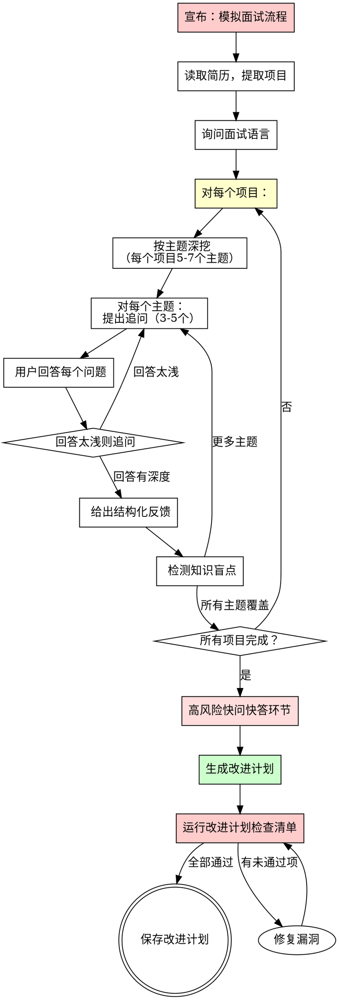

# 模拟面试工作流

## 概述

基于用户简历，逐项目进行深挖面试，配合结构化反馈和改进计划。

**核心原则：** 真正的技术面试不会只问"介绍一下你的项目"。他们会逐层深挖——从背景和角色边界，到数据和训练，到架构内部，到评估和失败模式。每个问题必须追溯到简历。每个回答必须被追问更深。

**违反流程的字面意思就是违反流程的精神。**

## 铁律

```
禁止泛泛的问题。禁止主观评分。禁止没有改进计划的面试。
```

问不是基于简历的泛泛问题？重启该项目。
给回答打数字分？删掉。用结构化反馈。
没有改进计划就结束？面试不完整。必须产出。

**无例外：**
- 不要问"介绍一下你自己"或"你最大的缺点是什么？"
- 不要给"7/10"或"B+"这样的评分——它们不可靠
- 不要因为"面试表现不错"就跳过改进计划
- 不要在一次面试中合并多个项目
- 不要赶问题——每个回答都要完整反馈
- 不要接受表面层次的回答而不追问

## 流程图



## 阶段1：设置

### 读取简历

向用户询问简历文件路径。读取整个文件。

**如果文件不存在：** 无法继续。简历是所有问题的基础。

**从简历中提取：**
- 所有项目列表（名称、背景、解决方案、成果、技术栈）
- 工作经验（角色、公司、时长）
- 列出的技能
- **对每个项目，识别深挖主题**（见阶段2）

### 询问面试语言

> "你希望用什么语言进行面试？
> - **英文** — 所有问题和反馈用英文
> - **中文** — 所有问题和反馈用中文
> - **混合** — 问题用你选择的语言，技术术语用英文"

**在整个面试过程中尊重用户的选择。** 不要中途切换语言。

## 阶段2：逐项目深挖

### 深挖方法

真正的技术面试不会每个主题问一个问题就过。他们按结构化的主题递进，对每个项目逐步深入。

**对每个项目，根据简历声明识别5-7个深挖主题。** 主题列表来自项目内容——不是通用清单。

#### 深挖主题递进

对每个项目，按顺序推进这些主题层。不是每个项目都有所有层——跳过不适用的层。

| 层级 | 主题 | 问题探测方向 |
|-------|-------|----------------|
| 1 | **项目背景与角色边界** | 这个项目解决什么问题？你具体做了什么 vs. 团队做了什么？ |
| 2 | **架构与设计决策** | 为什么选这个架构？考虑了哪些替代方案？做了什么权衡？ |
| 3 | **数据与训练**（ML/AI项目） | 数据从哪来？怎么标注的？多少数据？训练/验证/测试划分？ |
| 4 | **技术内部原理** | 组件X内部是怎么工作的？为什么这么设计？ |
| 5 | **评估与指标** | 如何衡量成功？精确率/召回率/F1？A/B测试？Bad Case分析？ |
| 6 | **失败模式与改进** | 出了什么问题？遇到了什么 Bad Case？怎么修的？ |
| 7 | **电梯演讲** | 能在2分钟内解释完整链条吗？ |

#### 每个主题的问题生成

对每个主题，生成3-5个逐步深入的问题：

**层级1——理解：** "X是做什么的？" / "X是怎么工作的？"
**层级2——推理：** "为什么选择X而不是Y？" / "如果X失败了会怎样？"
**层级3——自我认知：** "你会怎么做不同？" / "你对这个有什么不清楚的？"

**红旗 —— 停止并重新生成：**
- 适用于任何项目的问题（"介绍一下你的项目"）
- 关于简历中没有提到的技术的问题
- 泛泛的行为面试问题（"你最大的缺点是什么？"）
- 只问层级1问题（理解）而不深入追问
- 关于用户从简历中无法知道的主题的问题

### 追问规则

**当用户给出表面层次的回答时，你必须追问。** 不要接受浅薄的回答就继续。

**表面层次回答的信号：**
- 回答只描述做了什么，没有为什么或怎么做
- 回答使用模糊术语（"我们用了优化"）没有具体内容
- 回答回避数字（"提升了性能"）没有量化
- 回答推脱（"团队处理的"）没有个人贡献
- 回答是"不清楚" / "not sure" / "我不记得了"

**追问模式：**
| 浅层回答 | 追问探测 |
|---------------|-----------------|
| "我们用了 LoRA 微调" | "你用了什么 rank？为什么？LoRA 挂在哪些层上？" |
| "提升了准确率" | "从多少到多少？准确率怎么定义的？在什么测试集上？" |
| "团队构建了 Agent 系统" | "你具体构建了什么？你的角色边界是什么？" |
| "那个细节不太清楚" | 标记为知识盲点。继续下一个问题。不要纠结。 |
| "我们做了数据清洗" | "具体清洗了什么？去重？质量过滤？怎么做的？" |

### 面试格式

**一次问一个问题。** 等待用户回答后再继续。

> **项目：[名称] — 主题：[主题名称] — 问题 [X/Y]**
>
> [问题]
>
> 慢慢回答。准备好后输入你的回答。

**用户回答后，给出结构化反馈：**

```markdown
**参考回答**: [展示预期深度和结构的强回答。这不是用户"应该说的"逐字稿——
它展示了预期的具体性、技术推理和自我认知水平。包含具体数字、设计理据、
对替代方案和局限性的认知。]

**改进建议**: [关于缺失或可以加强的具体、可操作的建议。引用具体的技术、
概念或框架。指出回答停留在表面层次的地方以及应该达到的更深层。]

**知识盲点**: [如果回答暴露了根本性的知识盲点，列出它们并推荐学习资源。
如果没有盲点，说"未检测到显著知识盲点。"]
```

### 知识盲点检测

当用户说"不清楚" / "not sure" / "我不记得了" / 给出明显错误的回答时，**立即标记为知识盲点。** 这些盲点对改进计划至关重要。

**盲点检测信号：**
| 信号 | 揭示了什么 | 如何追问 |
|--------|----------------|-----------------|
| "不清楚" / "我不确定" | 表面层次理解，没有深入知识 | 标记盲点，提供简要解释，继续 |
| 自信但错误的回答 | 误解——面试中很危险 | 温和纠正，标记为优先盲点 |
| 模糊没有具体内容 | 使用了技术但不理解内部原理 | 问"内部是怎么工作的？"确认深度 |
| "团队处理的" | 角色边界不清——面试官会追问 | 问"你具体贡献了什么？" |
| 能解释做了什么但不能解释为什么 | 只有实现没有推理——高级岗位的红旗 | 问"为什么用这个方案而不是替代方案？" |
| 没有考虑过替代方案 | 单一方案思维 | 问"这个问题还有什么其他方案？" |

## 阶段3：高风险快问快答环节

**所有项目深挖完成后，进行覆盖横切关注点的快问快答环节。**

这个环节模拟真正技术面试中面试官快速测试知识广度和捕捉不一致的风格。

### 快问快答类别

从与用户简历声明相关的类别中选取问题：

1. **训练细节** — "几张卡？什么 batch size？什么学习率？bf16 还是 fp16？为什么？"
2. **评估严谨性** — "你怎么定义你的指标？测试集多大？谁标的？精确率还是召回率更重要？"
3. **Bad Case 处理** — "给我3个真实的 Bad Case。每个怎么修的？哪个模块出了问题？"
4. **消融证据** — "你怎么证明 LoRA/RAG/prompt 有帮助 vs. 基座模型？你做消融了吗？"
5. **架构极限** — "如果规模扩大10倍会坏什么？当前瓶颈在哪？"

**格式：** 连续问5-8个快问快答问题。只给简短反馈——标记盲点留给改进计划。

## 阶段4：改进计划

**这是必须的。** 每次面试都必须产出改进计划。

### 计划格式

```markdown
# 面试改进计划

## 总结
[简要总体评估——2-3句关于优势和成长领域的描述]

## 维度分析

| 维度 | 优势领域 | 成长领域 |
|-----------|-------------|--------------|
| 项目背景与角色 | [能清晰表达项目背景和个人贡献] | [具体弱点] |
| 架构与设计 | [具体优势] | [具体弱点] |
| 数据与训练 | [具体优势] | [具体弱点] |
| 技术内部原理 | [具体优势] | [具体弱点] |
| 评估与指标 | [具体优势] | [具体弱点] |
| 失败模式 | [具体优势] | [具体弱点] |
| 电梯演讲 | [能在2分钟内清晰解释每个项目] | [具体弱点] |

## 知识盲点清单

- [ ] **[盲点1]** — [什么不清楚/错了] → [推荐资源弥补盲点]
- [ ] **[盲点2]** — [什么不清楚/错了] → [推荐资源]
- [ ] **[盲点3]** — [什么不清楚/错了] → [推荐资源]

## 逐项目深挖总结

### [项目1名称]
- **覆盖主题：** [列出覆盖的深挖主题]
- **优势：** [表现好的方面——针对此项目具体]
- **需改进：** [需要加强的方面——针对此项目具体]
- **必须准备的证据：** [候选人在真正面试前应准备的具体材料]

### [项目2名称]
- [相同结构]

## 下一步行动

1. **[影响最大的改进]** — [具体行动及时间建议]
2. **[第二影响的改进]** — [具体行动及时间建议]
3. **[第三影响的改进]** — [具体行动及时间建议]

## "必须准备的证据"清单
[基于深挖，列出候选人应准备的具体材料：]
- [ ] [项目]的训练配置表
- [ ] [项目]的数据集统计表
- [ ] [项目]的评估指标定义表
- [ ] [项目]的3个真实 Bad Case
- [ ] 消融对比：仅 prompt vs. prompt+RAG vs. SFT/LoRA vs. 完整流水线
- [ ] 每个项目的2分钟电梯演讲，练习到流利
```

### 询问是否保存

> "你的改进计划准备好了。需要我保存吗？如果需要，保存到哪里？"

## 阶段5：改进计划检查清单

**保存改进计划之前，验证每一项：**

- [ ] 简历中的每个项目都被深挖（不只是表面问题）
- [ ] 每个项目覆盖了至少3个深挖主题
- [ ] 表面层次的回答被追问更深
- [ ] 每个回答都收到了结构化反馈（参考回答 + 改进建议 + 盲点）
- [ ] 知识盲点在面试过程中被检测和标记（不只是最后）
- [ ] 进行了覆盖横切关注点的快问快答环节
- [ ] "必须准备的证据"项目是具体和可操作的
- [ ] 逐项目笔记同时识别了优势和需改进的方面
- [ ] 改进计划使用用户选择的语言
- [ ] 整个面试过程中没有给出任何主观评分

**有任何项未通过？先修复再保存。无例外。**

## 常见借口

| 借口 | 事实 |
|--------|---------|
| "我给他们打个分比如7/10" | 评分不可靠且不可操作。用结构化反馈。 |
| "通用问题练习也行" | 通用练习不准备真正的面试。用基于简历的深挖。 |
| "我一次问完所有问题" | 太多了。一次一个。对浅层回答深入追问。 |
| "改进计划对强候选人不必要" | 每个候选人都有盲点。计划就是模拟面试的价值。 |
| "我可以跳过快问快答环节" | 快问快答捕捉深挖遗漏的不一致。永远不要跳过。 |
| "我只列出盲点就行，不需要推荐资源" | 没有资源的盲点只是抱怨，不是帮助。始终推荐如何弥补。 |
| "一个项目就够一次面试了" | 真正的面试覆盖所有项目。完成完整面试或明确询问用户是否想停止。 |
| "他们的回答够好了，不需要追问" | 练习中"够好" ≠ 面试中"够好"。追问直到展示深度。 |
| "他们说'不清楚'，我就继续吧" | 知识盲点必须标记。它们是面试最有价值的输出。 |
| "我不需要问他们具体的角色边界" | 面试官总会追问"你做了什么 vs. 团队做了什么"。必须问。 |
