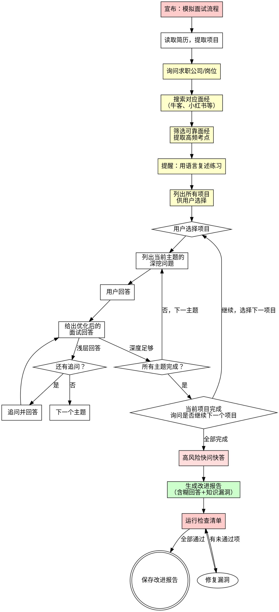

# 模拟面试工作流

## 概述

基于用户简历和目标岗位面经，逐项目、逐主题进行深挖面试，配合结构化反馈和改进计划。

**核心原则：** 真正的技术面试不会只问"介绍一下你的项目"。他们会逐层深挖——从背景和角色边界，到数据和训练，到架构内部，到评估和失败模式。每个问题必须追溯到简历。每个回答必须被追问更深。

**语言：全程中文问答。** 不询问语言偏好，直接使用中文。技术术语可保留英文原文。

**违反流程的字面意思就是违反流程的精神。**

## 铁律

```
禁止泛泛的问题。禁止主观评分。禁止没有改进计划的面试。禁止不搜索面经就出题。
```

问不是基于简历的泛泛问题？重启该项目。
给回答打数字分？删掉。用结构化反馈。
没有搜索面经就出题？先搜索再出题。
没有改进计划就结束？面试不完整。必须产出。

**无例外：**
- 不要问"介绍一下你自己"或"你最大的缺点是什么？"
- 不要给"7/10"或"B+"这样的评分——它们不可靠
- 不要因为"面试表现不错"就跳过改进计划
- 不要在一次面试中合并多个项目
- 不要接受表面层次的回答而不追问
- 不要跳过主题——每个主题问完再进下一个
- 不要在用户回答一个主题前就列出所有主题的问题
- 不要自行决定项目面试顺序——必须让用户选择

## 流程图



## 阶段1：设置

### 读取简历

向用户询问简历文件路径。读取整个文件。

**如果文件不存在：** 无法继续。简历是所有问题的基础。

**从简历中提取：**
- 所有项目列表（名称、背景、解决方案、成果、技术栈）
- 工作经验（角色、公司、时长）
- 列出的技能
- **对每个项目，识别深挖主题**（见阶段3）

### 询问求职公司/岗位

向用户询问：

> "你的目标公司和岗位是什么？例如：
> - 字节跳动 — 推荐算法工程师
> - 蚂蚁集团 — 后端开发
> - 腾讯 — NLP 算法工程师
> - 或者只说岗位方向也行（如：后端开发、CV算法、前端）"

**等待用户回复。** 不要假设。

### 搜索面经

<EXTREMELY-IMPORTANT>
必须联网搜索面经。不能凭训练数据"知道"面试会问什么。面经的时效性和针对性是模拟面试的核心价值。
</EXTREMELY-IMPORTANT>

**根据用户的目标岗位，搜索对应面经：**

1. **搜索牛客网面经** — 搜索关键词格式：`[公司] [岗位] 面经 site:nowcoder.com`
2. **搜索小红书面经** — 搜索关键词格式：`[公司] [岗位] 面经 site:xiaohongshu.com`
3. **搜索综合面经** — 搜索关键词格式：`[公司] [岗位] 技术面试 2024/2025`

**面经可靠性筛选：**

| 信号 | 可靠性 | 处理方式 |
|------|--------|----------|
| 具体公司+部门+岗位+时间 | 高 | 优先采用 |
| 具体问题+回答思路 | 高 | 优先采用 |
| 只有笼统描述（"问了算法"） | 低 | 仅参考方向 |
| 匿名且无法验证 | 中低 | 交叉验证后采用 |
| 多篇面经反复出现的高频考点 | 高 | 必须纳入面试题 |
| 只出现一次的偏门问题 | 低 | 可选纳入 |

**提取面经关键信息：**
- 高频面试问题（多篇面经重复出现的）
- 考察重点方向（哪些技术栈被重点问）
- 面试风格（偏理论？偏项目？偏系统设计？）
- 特殊考察点（某些部门特有的面试方式）

**将搜索结果整理为面经摘要，向用户展示：**

```markdown
## 面经摘要

**目标岗位：** [公司] [岗位]

**数据来源：** 搜索了 N 篇面经（牛客 X 篇，小红书 Y 篇，其他 Z 篇）

**高频考点 Top 5：**
1. [考点1] — 出现频率 X/N
2. [考点2] — 出现频率 X/N
3. [考点3] — 出现频率 X/N
4. [考点4] — 出现频率 X/N
5. [考点5] — 出现频率 X/N

**面试风格：** [偏理论/偏项目深挖/偏系统设计/偏手写代码/混合]

**特殊考察点：** [如有]

**面经参考的问题将融入后续深挖环节。**
```

### 语言复述提醒

在面试开始前，**必须向用户强调：**

> ⚠️ **面试准备最重要的建议：看答案是被动记忆，用语言复述才是主动记忆。**
>
> 接下来每个问题我都会给出参考回答，但**只看不够**——你必须：
> 1. **合上参考回答，用自己的话复述一遍** —— 能说出来才是真会了
> 2. **录音回听** —— 你会发现自己以为说清楚了其实没有
> 3. **反复练习到流利** —— 面试时紧张会让表达打折扣，只有练到肌肉记忆才稳
>
> 看了10遍不如说出来1遍。从现在开始，每个问题的参考回答，请先自己口头复述，再看参考对照。

**在面试过程中，每完成一个主题后提醒一次：**

> 💡 **提醒：** 这些参考回答你口头复述过了吗？说出来才是你的。

## 阶段2：面经驱动的问题定制

**所有面试问题必须同时基于简历内容和面经信息。**

- **简历决定问什么项目、什么技术** — 问题必须追溯到简历声明
- **面经决定怎么问、问多深** — 问题风格和深度对标真实面试
- **两者结合** — 在用户的项目上下文中，用面经中高频出现的方式提问

**红旗 —— 停止并重新生成：**
- 没有搜索面经就出题——面经是模拟面试的核心价值
- 只用通用模板，不结合面经的高频考点
- 面经中反复出现的考点没有出现在问题中
- 问题风格与面经描述的面试风格不符

## 阶段3：用户选择项目，逐项目逐主题深挖

### 项目选择（每次面试开始前）

<EXTREMELY-IMPORTANT>
必须让用户选择面试哪个项目。不能由模型自行决定项目顺序。
</EXTREMELY-IMPORTANT>

**从简历中提取所有项目后，向用户展示项目列表并询问：**

> 📋 **你的简历中有以下项目：**
>
> 1. **[项目1名称]** — [一句话概述]
> 2. **[项目2名称]** — [一句话概述]
> 3. **[项目3名称]** — [一句话概述]
>
> **你想从哪个项目开始面试？** 请选择编号。
>
> 💡 建议：优先选择与目标岗位最相关的项目，或者你最没有把握的项目。

**等待用户选择。** 不要假设。不要自行排序。

**用户选择后，进入该项目的逐主题深挖。**

**一个项目所有主题完成后，再次询问：**

> ✅ **[项目名称] 的面试深挖已完成。**
>
> 剩余项目：
> 1. **[项目X名称]** — [一句话概述]
> 2. **[项目Y名称]** — [一句话概述]
>
> **接下来你想面试哪个项目？** 或者输入"结束"进入快问快答环节。

**用户可以选择：**
- 选择一个剩余项目继续深挖
- 输入"结束"进入快问快答环节
- 输入"全部"继续剩余所有项目

**红旗 —— 停止并修正：**
- 不让用户选择就自动开始面试某个项目
- 按简历上的顺序自动推进，不询问用户
- 用户想跳过某个项目但强制面试
- 一个项目完成后不询问就直接开始下一个

### 深挖方法

真正的技术面试不会每个主题问一个问题就过。他们按结构化的主题递进，对每个项目逐步深入。

**对每个项目，根据简历声明识别5-7个深挖主题。** 主题列表来自项目内容——不是通用清单。

**关键流程：逐主题推进，每个主题问完、用户回答、给出优化回答后，再进下一个主题。**

#### 深挖主题递进

对每个项目，按顺序推进这些主题层。不是每个项目都有所有层——跳过不适用的层。

| 层级 | 主题 | 问题探测方向 |
|-------|-------|----------------|
| 1 | **项目背景与角色边界** | 这个项目解决什么问题？你具体做了什么 vs. 团队做了什么？ |
| 2 | **架构与设计决策** | 为什么选这个架构？考虑了哪些替代方案？做了什么权衡？ |
| 3 | **数据与训练**（ML/AI项目） | 数据从哪来？怎么标注的？多少数据？训练/验证/测试划分？ |
| 4 | **技术内部原理** | 组件X内部是怎么工作的？为什么这么设计？ |
| 5 | **评估与指标** | 如何衡量成功？精确率/召回率/F1？A/B测试？Bad Case分析？ |
| 6 | **失败模式与改进** | 出了什么问题？遇到了什么 Bad Case？怎么修的？ |

#### 逐主题提问流程

**对每个项目，一个主题一个主题地推进：**

> **项目：[项目名称] — 主题1：项目背景与角色边界**
>
> 根据你的简历和目标岗位面经，我准备了以下问题：
>
> 1. [问题1——结合面经高频考点和简历内容]
> 2. [问题2]
> 3. [问题3]
>
> 请逐一回答。回答完后我会给出优化后的面试回答。
>
> 💡 **提醒：用你自己的话回答，不要背答案。**

**用户回答后，立即给出该主题的优化回答和反馈：**

```markdown
## 主题1：项目背景与角色边界 — 反馈

### Q1：[问题]

**你的回答摘要：** [简短摘要]

**优化后的面试回答：**
[展示一个经过优化的、有深度的面试回答。这不是用户"应该说的"逐字稿——
而是展示了预期的具体性、技术推理和自我认知水平。参考面经中该岗位
高频考察点，突出面试官最关注的维度。]

**改进要点：**
- [具体改进建议1]
- [具体改进建议2]

**知识盲点：** [如有，列出并推荐学习资源。如无，标注"未检测到"]

---

### Q2：[问题]
[同上结构]
```

**如果有浅层回答，追问后再给出优化回答：**

> 你对 Q[X] 的回答偏浅——你提到了[浅层内容]，但[具体追问]。能更深入地说说吗？

用户补充回答后，再给出该问题的优化回答。

**该主题所有问题反馈完毕后，进入下一个主题：**

> ✅ 主题1完成。进入主题2：架构与设计决策。
>
> **项目：[项目名称] — 主题2：架构与设计决策**
>
> 1. [问题1]
> 2. [问题2]
> 3. [问题3]
>
> 请逐一回答。

**所有主题完成后，询问用户是否继续下一个项目（见阶段3项目选择流程）。**

#### 问题生成规则

**每个主题生成3-5个逐步深入的问题：**

- **层级1——理解：** "X是做什么的？" / "X是怎么工作的？"
- **层级2——推理：** "为什么选择X而不是Y？" / "如果X失败了会怎样？"
- **层级3——自我认知：** "你会怎么做不同？" / "你对这个有什么不清楚的？"

**面经驱动：** 如果面经中某个考点与当前主题相关，必须以面经中的方式提问。

**红旗 —— 停止并重新生成：**
- 适用于任何项目的问题（"介绍一下你的项目"）
- 关于简历中没有提到的技术的问题
- 泛泛的行为面试问题（"你最大的缺点是什么？"）
- 只问层级1问题（理解）而不深入追问
- 关于用户从简历中无法知道的主题的问题
- 问题风格与面经描述的面试风格不符

### 追问规则

**当用户给出表面层次的回答时，你必须追问更深。** 不要接受浅薄的回答就继续。

**表面层次回答的信号：**
- 回答只描述做了什么，没有为什么或怎么做
- 回答使用模糊术语（"我们用了优化"）没有具体内容
- 回答回避数字（"提升了性能"）没有量化
- 回答推脱（"团队处理的"）没有个人贡献
- 回答是"不清楚" / "不太记得了"

**追问模式：**

| 浅层回答 | 追问探测 |
|---------------|-----------------|
| "我们用了 LoRA 微调" | "你用了什么 rank？为什么？LoRA 挂在哪些层上？" |
| "提升了准确率" | "从多少到多少？准确率怎么定义的？在什么测试集上？" |
| "团队构建了 Agent 系统" | "你具体构建了什么？你的角色边界是什么？" |
| "那个细节不太清楚" | 标记为知识盲点。继续下一个问题。不要纠结。 |
| "我们做了数据清洗" | "具体清洗了什么？去重？质量过滤？怎么做的？" |

### 知识盲点检测

当用户说"不清楚" / "不太确定" / "我不记得了" / 给出明显错误的回答时，**立即标记为知识盲点。** 这些盲点对改进报告至关重要。

**盲点检测信号：**

| 信号 | 揭示了什么 | 如何追问 |
|--------|-----------------|----------------|
| "不清楚" / "我不确定" | 表面层次理解，没有深入知识 | 标记盲点，提供简要解释，继续 |
| 自信但错误的回答 | 误解——面试中很危险 | 温和纠正，标记为优先盲点 |
| 模糊没有具体内容 | 使用了技术但不理解内部原理 | 问"内部是怎么工作的？"确认深度 |
| "团队处理的" | 角色边界不清——面试官会追问 | 问"你具体贡献了什么？" |
| 能解释做了什么但不能解释为什么 | 只有实现没有推理——高级岗位的红旗 | 问"为什么用这个方案而不是替代方案？" |
| 没有考虑过替代方案 | 单一方案思维 | 问"这个问题还有什么其他方案？" |

## 阶段4：高风险快问快答环节

**所有用户选择的项目深挖完成后（或用户选择"结束"），进行覆盖横切关注点的快问快答环节。**

这个环节模拟真正技术面试中面试官快速测试知识广度和捕捉不一致的风格。**问题应参考面经中的高频快问。**

### 快问快答类别

从与用户简历声明和面经高频考点相关的类别中选取问题：

1. **训练细节** — "几张卡？什么 batch size？什么学习率？bf16 还是 fp16？为什么？"
2. **评估严谨性** — "你怎么定义你的指标？测试集多大？谁标的？精确率还是召回率更重要？"
3. **Bad Case 处理** — "给我3个真实的 Bad Case。每个怎么修的？哪个模块出了问题？"
4. **消融证据** — "你怎么证明 LoRA/RAG/prompt 有帮助 vs. 基座模型？你做消融了吗？"
5. **架构极限** — "如果规模扩大10倍会坏什么？当前瓶颈在哪？"

### 快问快答格式

**一次列出所有快问快答问题，让用户批量回答：**

> **⚡ 快问快答环节**
>
> 以下是横切你所有项目的快速问题，结合了目标岗位面经中的高频考点。请逐个简短回答：
>
> 1. [问题1]
> 2. [问题2]
> 3. [问题3]
> ...
>
> 💡 **这些短问题更适合快速口头回答——试试不开键盘，直接说出来。**

**用户回答后，标记盲点并给出简要反馈——详细改进留给阶段5。**

## 阶段5：改进报告

**这是必须的。** 每次面试都必须产出改进报告。

**报告侧重于两个核心：含糊不清的回答 + 基础知识漏洞。** 不是泛泛的"你表现得不错"，而是精准定位哪里说不清楚、哪里知识有缺。

**在改进报告开头，再次强调语言复述的重要性：**

> ⚠️ **最重要的一步：把参考回答变成你能说出来的话。**
>
> 以上每个问题的参考回答，请务必：
> 1. 合上文档，用自己的话复述
> 2. 录音回听，找出卡壳的地方
> 3. 对卡壳的地方重新组织语言，再练
> 4. 重复直到每个问题都能流利回答
>
> **看了不等于会了，说出来才是你的。**

### 报告格式

```markdown
# 面试改进报告

## 总结
[2-3句关于整体表现的评估——重点指出最大的改进方向]

## ⚠️ 含糊不清的回答

以下问题你的回答含糊或停留在表面，需要重新组织语言：

### [项目1名称]

**Q：[问题]**
- **你说的是：** [含糊回答的摘要]
- **问题所在：** [为什么含糊——缺少数字？缺少原因？缺少个人贡献？]
- **应该怎么说：** [优化后的完整回答]

**Q：[问题]**
- **你说的是：** [含糊回答的摘要]
- **问题所在：** [原因]
- **应该怎么说：** [优化后的完整回答]

### [项目2名称]
[同上结构]

---

## 🔴 基础知识漏洞

以下是你回答中暴露的知识盲点，按严重程度排序：

### 🔴 严重（必须补）

- [ ] **[漏洞1]** — [具体描述不清楚/错了什么] → **推荐资源：** [具体的学习资源]
  - 相关问题：[哪个问题暴露了这个漏洞]
  - 面经高频：[如果面经中也高频出现，标注]

- [ ] **[漏洞2]** — [描述] → **推荐资源：** [资源]
  - 相关问题：[哪个问题]

### 🟡 重要（应该补）

- [ ] **[漏洞3]** — [描述] → **推荐资源：** [资源]

### 🟢 可选（锦上添花）

- [ ] **[漏洞4]** — [描述] → **推荐资源：** [资源]

---

## 面经高频考点覆盖情况

| 面经高频考点 | 你的表现 | 状态 |
|--------------|----------|------|
| [考点1] | [简述] | ✅ 已掌握 / ⚠️ 需加强 / ❌ 未掌握 |
| [考点2] | [简述] | ✅ 已掌握 / ⚠️ 需加强 / ❌ 未掌握 |
| [考点3] | [简述] | ✅ 已掌握 / ⚠️ 需加强 / ❌ 未掌握 |

---

## 逐项目深挖总结

### [项目1名称]
- **覆盖主题：** [列出覆盖的深挖主题]
- **优势：** [表现好的方面——针对此项目具体]
- **含糊回答：** [列出该项目中含糊的问题]
- **知识漏洞：** [列出该项目暴露的漏洞]

### [项目2名称]
[同上结构]

---

## 下一步行动（按优先级排序）

1. **[最严重漏洞]** — [具体行动及时间建议]
2. **[次严重漏洞/含糊回答]** — [具体行动及时间建议]
3. **[第三优先级]** — [具体行动及时间建议]

---

## "必须准备的证据"清单
[基于深挖和面经，列出候选人应准备的具体材料：]
- [ ] [项目]的训练配置表
- [ ] [项目]的数据集统计表
- [ ] [项目]的评估指标定义表
- [ ] [项目]的3个真实 Bad Case
- [ ] 消融对比：仅 prompt vs. prompt+RAG vs. SFT/LoRA vs. 完整流水线
- [ ] 每个项目的2分钟电梯演讲，练习到流利
- [ ] 面经高频考点的标准回答，口头练习3遍以上
```

### 询问是否保存

> "你的改进报告准备好了。需要我保存吗？如果需要，保存到哪里？"

## 阶段6：改进报告检查清单

**保存改进报告之前，验证每一项：**

- [ ] 简历中的每个项目都被深挖（不只是表面问题）
- [ ] 每个项目覆盖了至少3个深挖主题
- [ ] 每个主题是逐个推进的（不是一次列出所有主题的问题）
- [ ] 每个用户回答都给出了优化后的面试回答
- [ ] 表面层次的回答被追问更深
- [ ] 知识盲点在面试过程中被检测和标记（不只是最后）
- [ ] 进行了覆盖横切关注点的快问快答环节
- [ ] 搜索了目标岗位的面经并融入问题
- [ ] 面经高频考点在改进报告中有覆盖情况分析
- [ ] 改进报告侧重含糊回答和知识漏洞，不是泛泛评价
- [ ] "必须准备的证据"项目是具体和可操作的
- [ ] 逐项目笔记同时识别了优势和含糊/漏洞
- [ ] 整个面试过程中没有给出任何主观评分
- [ ] 全程使用中文问答
- [ ] 已提醒用户用语言复述练习（至少3次：开始+中间+报告结尾）

**有任何项未通过？先修复再保存。无例外。**

## 常见借口

| 借口 | 事实 |
|--------|---------|
| "我给他们打个分比如7/10" | 评分不可靠且不可操作。用结构化反馈。 |
| "通用问题练习也行" | 通用练习不准备真正的面试。用基于简历的深挖。 |
| "我不需要搜索面经" | 面经是模拟面试的核心价值。没有面经就是通用练习。 |
| "面经不可靠，不值得参考" | 多篇面经反复出现的高频考点非常可靠。交叉验证后采用。 |
| "改进报告只要列出漏洞就行" | 含糊回答和知识漏洞同样重要。含糊是表达问题，漏洞是知识问题，两者都要。 |
| "改进计划对强候选人不必要" | 每个候选人都有盲点。计划就是模拟面试的价值。 |
| "我可以跳过快问快答环节" | 快问快答捕捉深挖遗漏的不一致。永远不要跳过。 |
| "我只列出盲点就行，不需要推荐资源" | 没有资源的盲点只是抱怨，不是帮助。始终推荐如何弥补。 |
| "一个项目就够一次面试了" | 真正的面试覆盖所有项目。完成完整面试或明确询问用户是否想停止。 |
| "他们说'不清楚'，我就继续吧" | 知识盲点必须标记。它们是面试最有价值的输出。 |
| "我不需要问他们具体的角色边界" | 面试官总会追问"你做了什么 vs. 团队做了什么"。必须问。 |
| "一次列出所有问题效率更高" | 逐主题推进才像真实面试。每个主题回答后立即给优化回答，用户学得更多。 |
| "用户看参考回答就够了" | 看不等于会。必须提醒用户用语言复述，主动记忆才有效。 |
| "语言复述提醒一次就行" | 至少提醒3次：开始时+每个主题后+报告结尾。 |
| "我按简历顺序自动面试就行" | 用户最清楚自己想先练哪个项目。必须让用户选择顺序。 |
| "一个项目面完直接进下一个" | 必须询问用户是否继续以及选择哪个项目。用户可能想先暂停或跳过某个项目。 |
