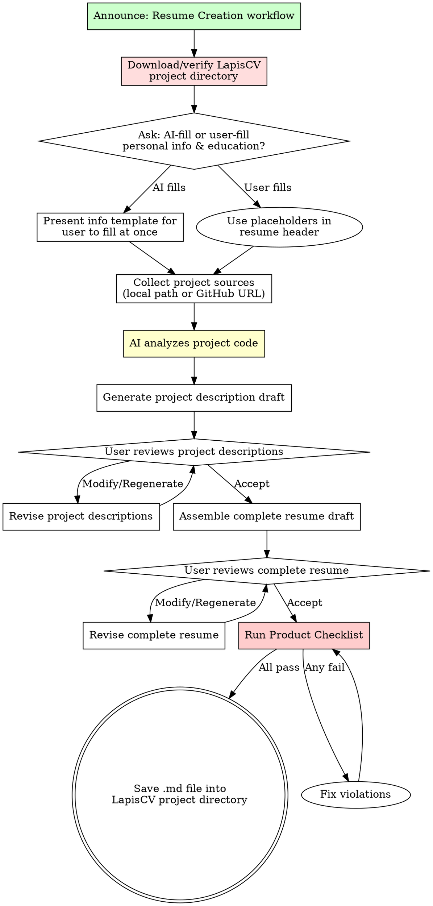

# Resume Creation Workflow

## Overview

Build a LapisCV-format resume from scratch through iterative information gathering and project analysis.

**Core principle:** Every bullet point comes from real project evidence. No fabrication. No generic descriptions.

**Violating the letter of this process is violating the spirit of this process.**

## The Iron Law

```
NO RESUME CONTENT WITHOUT PROJECT EVIDENCE
```

Write a bullet point without analyzing the project? Delete it. Start over.

**No exceptions:**
- Don't fabricate metrics or achievements
- Don't use generic descriptions from "common resume templates"
- Don't skip project analysis because "the user described it already"
- Don't produce final output without at least 2 review rounds

## Process Flow



## Phase 1: Setup LapisCV Environment

**MANDATORY FIRST STEP.** Do not skip this. LapisCV requires CSS stylesheets, fonts, and VS Code settings to render correctly — a standalone .md file will NOT produce a proper resume.

### Download and Setup

Run the download script from the skill directory:

```bash
bash skills/mokio-interview-skill/scripts/download-lapiscv.sh [target_dir]
```

- `target_dir` is optional (default: `./lapis-cv-project`)
- If LapisCV is already downloaded, the script will detect it and skip

**If the user already has a LapisCV project directory**, ask where it is and use that instead of downloading again.

After running the script, the resume .md file MUST be saved inside the target directory (alongside `lapis-cv/styles/` and `lapis-cv/fonts/`).

## Phase 2: Information Collection

### Step 1: Ask How to Handle Personal Info & Education

Ask the user ONE question:

> "Would you like me to generate the personal info and education sections, or will you fill them in yourself later?
> - **AI generates** — I'll provide a template for you to fill out all at once, then I'll format it into the resume
> - **I'll fill in myself** — I'll leave placeholders in the resume for you to fill in later"

### Step 2A: AI Generates (Template-Based Collection)

If the user chooses AI generation, present this template for them to fill out **all at once**:

```
请填写以下信息（可选字段可留空）：

姓名：
学校：
学历与专业：（如：本科 - 人工智能专业）
就读时间：（如：2020.09 - 2024.06）
手机号：
微信号：
邮箱：
GitHub：（可选，格式：github.com/username）
个人网站/博客：（可选）
头像图片URL：（可选，留空则不显示）

奖项与荣誉：（可选，多个用逗号分隔）
校园经历：（可选，如：担任XX社团负责人）
```

**The user fills out the entire template in one response.** Do NOT ask each field individually.

If the user leaves optional fields blank, omit them from the resume. Do NOT invent content.

### Step 2B: User Fills In Themselves (Placeholder Mode)

If the user chooses self-fill, use placeholders in the resume:

```markdown
# [Your Name]

> <span alt="icon">&#xe60f;</span> `[Phone Number]`&emsp;&emsp; <span alt="icon">&#xe7ca;</span> `[Email]`&emsp;&emsp; <span alt="icon">&#xe600;</span> [GitHub Link]

## &#xe80c; Education

<div alt="entry-title">
    <h3>[University] - [Degree] - [Major]</h3>
    <p>[Start Date] - [End Date]</p>
</div>
```

### Step 3: Collect Project Sources

After personal info is handled, ask about projects **one project at a time**:

> "Please provide the first project you want on your resume. You can give me:
> - A local directory path (I'll read the code and README)
> - A GitHub repository URL
> - A description of the project (least preferred — I'll ask follow-up questions)"

**For each project, collect:**
- Project name
- Source (directory / URL / description)
- Their role in the project

**After each project:** "Any more projects to add? If not, I'll analyze each project's code."

## Phase 2: Project Analysis

**MANDATORY.** This is where resume content comes from. Skipping this = fabrication.

### For Local Directory

```
1. Read README.md or equivalent documentation
2. Read package.json / Cargo.toml / go.mod / equivalent (tech stack)
3. Read main source files (architecture, key algorithms)
4. Scan directory structure (understand components)
5. Identify: key technologies, architecture decisions, quantifiable outcomes
```

### For GitHub URL

```
1. Read the repository README
2. Identify tech stack from repository files
3. Read key source files that demonstrate technical depth
4. Identify: key technologies, architecture decisions, quantifiable outcomes
```

### For User Description Only

If the user only provides a description (no code access):

1. Ask **3 specific follow-up questions** about technical decisions and outcomes:
   - "What was the most challenging technical problem you solved in this project?"
   - "What technologies did you use, and why did you choose them?"
   - "Can you quantify the impact? (users, performance improvement, scale, etc.)"
2. Generate bullet points based ONLY on what the user confirmed

**Red Flags — STOP and Fix:**
- Writing bullet points without reading any project code or docs
- Using phrases like "responsible for" or "worked on" (weak verbs)
- Including metrics the user never mentioned
- Generating generic descriptions like "collaborated with team members"
- Skipping the follow-up questions when no code is available

## Phase 3: Draft Generation

### Project Description Draft

For each project, generate:

1. **Project Background** — One sentence explaining the problem context and why the project exists. This gives interviewers a starting point for follow-up questions.
2. **Solution** — 2-4 bullet points describing what the candidate did, with technical specifics and architecture decisions
3. **Result** — Quantified outcomes — metrics, improvements, deliverables

**The "Background → Solution → Result" structure** is the standard for high-performing technical resumes. It maps directly to interview questioning:

| Resume Section | Interview Question It Answers |
|---------------|------------------------------|
| **Background** | "What problem were you solving? Why did this project exist?" |
| **Solution** | "What did YOU do? What technical decisions did you make? Why this approach?" |
| **Result** | "What was the impact? How do you know it worked?" |

**Example of the ideal structure:**

```
## &#xe635; Projects

<div alt="entry-title">
    <h3>ChangeAgent</h3>
    <a href="https://github.com/...">github.com/.../changeagent</a>
</div>

**Project Background:** API gateway configuration risk assessment agent for pre-release
change review, addressing complex config fields, scattered risk samples, and unclear
upstream-downstream impact chains.

**Solution:**
- **Built** risk assessment agent using DeepSeek-V3 + LoRA domain adaptation with SFT
instruction tuning on business-annotated risk samples, improving config parsing accuracy
and output stability
- **Designed** RAG risk knowledge base with Tool Calling for real-time config queries,
service tree lookups, and upstream-downstream chain analysis
- **Implemented** data flywheel: service release → config diff extraction → risk sample
annotation → RAG ingestion → LoRA fine-tuning → evaluation feedback loop

**Result:** Risk identification accuracy improved from 50% to 70%, average response time
reduced from 2min to 1min; formed complete algorithm loop covering data annotation, LoRA
fine-tuning, RAG retrieval, Agent reasoning, and evaluation.
```

**Bullet point quality ladder:**

| Level | Example | Verdict |
|-------|---------|---------|
| Bad | Worked on the backend | No verb strength, no detail, no result |
| Weak | Implemented REST API endpoints | Verb OK, no detail, no result |
| Better | Implemented REST API with Express.js for user management | Detail added, no result |
| Best | **Implemented** REST API with Express.js and JWT auth, handling 5K+ daily active users with 99.9% uptime | Full structure |

**Background mistakes to avoid:**
- No background at all (jumps straight into "Implemented X") — interviewer has no context
- Background is too vague ("A web application") — doesn't explain what problem existed
- Background mixes with solution — keep them separate for clarity

**The 2-minute pitch test:** Each project entry should contain enough information that the candidate could explain the complete chain in 2 minutes: What problem → What I decided → How I did it → What resulted. If any link is missing, the entry is incomplete.

Present project descriptions for user review:

> **Project: [Name]**
>
> **Background:** [one sentence]
>
> **Solution:**
> [bullet points]
>
> **Result:** [quantified outcomes]
>
> **Accept** / **Modify** / **Regenerate**

### Complete Resume Draft

After all project descriptions are accepted, assemble the full resume using the LapisCV template (see lapiscv-template.md).

**The resume .md file MUST be saved inside the LapisCV project directory** (the directory containing `lapis-cv/styles/` and `lapis-cv/fonts/`). A standalone .md file without the CSS/fonts will NOT render correctly.

**Assembly order:**
1. Header (name + contact bar + avatar)
2. Education section
3. Work Experience section (if user provided work info)
4. Projects section
5. Skills section (extracted from project tech stacks)

Present complete draft for user review:

> **Full Resume Draft**
>
> [Complete Markdown]
>
> **Accept** / **Modify** / **Regenerate**

## Phase 4: Product Checklist

**Before saving the final file, verify EVERY item:**

- [ ] `h1` = Full name (not "Resume" or "CV")
- [ ] `blockquote` = Contact info with icon prefixes (`&#xe60f;` phone, `&#xe7ca;` email, `&#xe600;` link)
- [ ] `img alt="avatar"` = Present if user provided photo URL
- [ ] Each section uses `h2` + icon prefix (`&#xe80c;` Education, `&#xe618;` Work, `&#xe635;` Projects, `&#xecfa;` Skills)
- [ ] Each entry uses `div alt="entry-title"` with `h3` and `p` (or `a` for project links)
- [ ] Date format is consistent throughout (English: `Month Year`, Chinese: `YYYY.MM`)
- [ ] Every bullet point uses strong verbs (led/designed/implemented/optimized, NOT worked on/helped with)
- [ ] Every bullet point includes specific technical detail (not generic)
- [ ] At least 50% of bullet points include quantified results
- [ ] No fabricated metrics — every number traces back to user input or code analysis
- [ ] Skills section lists technologies actually found in projects
- [ ] `---` page break used appropriately if resume exceeds one page

**Any item fails? Fix it before saving. No exceptions.**

## Common Rationalizations

| Excuse | Reality |
|--------|---------|
| "I can write good bullet points without reading the code" | You can't. You'll write generic fluff. Read the code. |
| "The user described the project, that's enough" | Descriptions lack technical depth. Code reveals architecture decisions. |
| "I'll add common skills like 'team player'" | Soft skills in Skills section are worthless. List technologies. |
| "One review round is enough" | It never is. First drafts always have issues. |
| "I'll generate a complete resume first, then review" | No. Draft project descriptions first, review each, then assemble. |
| "The checklist is overkill for a simple resume" | Simple resumes still have format errors. Run the checklist. |
| "I don't need to provide a template, I'll ask one by one" | Batching personal info in a template is faster and less tedious. One-at-a-time is for projects, not form fields. |
