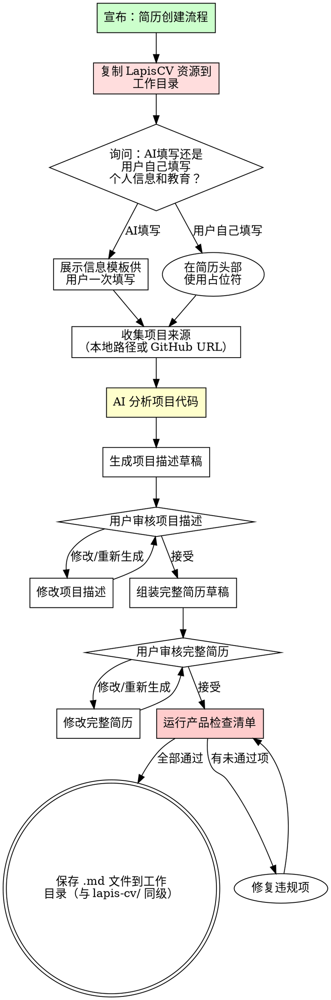

# 简历创建工作流

## 概述

通过迭代式信息收集和项目分析，从零构建 LapisCV 格式简历。

**核心原则：** 每个要点都来自真实项目证据。不编造。不使用泛泛描述。

**违反流程的字面意思就是违反流程的精神。**

## 铁律

```
没有项目证据就没有简历内容
```

没有分析项目就写要点？删掉。重做。

**无例外：**
- 不要编造指标或成就
- 不要使用"常见简历模板"的泛泛描述
- 不要因为"用户已经描述了"就跳过项目分析
- 不要在少于2轮审核的情况下输出最终结果

## 流程图



## 阶段1：设置 LapisCV 环境

**必须首先执行的步骤。** 不要跳过。LapisCV 需要 CSS 样式表、字体和 VS Code 设置才能正确渲染——单独的 .md 文件无法生成正确的简历。

### 复制 LapisCV 资源到工作目录

将以下内容从 `assets/lapis-cv-vscode-v2.0.1/` 复制到用户当前工作目录（平铺，不放入子目录）：

```bash
SKILL_DIR="skills/mokio-interview-skill"
cp -r "${SKILL_DIR}/assets/lapis-cv-vscode-v2.0.1/.vscode" ./
cp -r "${SKILL_DIR}/assets/lapis-cv-vscode-v2.0.1/lapis-cv" ./
cp "${SKILL_DIR}/assets/lapis-cv-vscode-v2.0.1/template-cn.md" ./
cp "${SKILL_DIR}/assets/lapis-cv-vscode-v2.0.1/template-en.md" ./
```

**如果工作目录已有全部四项**（`.vscode/`、`lapis-cv/`、`template-cn.md`、`template-en.md`），跳过此步骤。

复制后，工作目录应如下：

```
.
├── .vscode/
│   └── settings.json
├── lapis-cv/
│   ├── fonts/
│   │   ├── JetBrainsMono-Regular.ttf
│   │   ├── SourceHanSansCN-Bold.ttf
│   │   ├── SourceHanSansCN-Medium.ttf
│   │   ├── SourceHanSansCN-Regular.ttf
│   │   ├── SourceHanSerifCN-Bold.ttf
│   │   └── iconfont.ttf
│   └── styles/
│       ├── lapis-cv-serif.css
│       ├── lapis-cv.css
│       └── main.css
├── template-cn.md
└── template-en.md
```

**为什么平铺复制？** `.vscode/settings.json` 通过相对路径引用 `./lapis-cv/styles/...`。如果简历 .md 在子目录中，CSS 将无法在 VS Code Markdown 预览中加载。

## 阶段2：信息收集

### 步骤1：询问如何处理个人信息和教育经历

向用户提出一个问题：

> "你希望我生成个人信息和教育经历部分，还是你之后自己填写？
> - **AI 生成** —— 我提供一个模板，你一次填写所有信息，然后我格式化到简历中
> - **我自己填写** —— 我在简历中留占位符，你之后自己填写"

### 步骤2A：AI 生成（模板式收集）

如果用户选择 AI 生成，展示以下模板供其**一次全部填写**：

```
请填写以下信息（可选字段可留空）：

姓名：
学校：                   学历：              专业：
就读时间：               （如：2020.09 - 2024.06）
手机号：
微信号：
邮箱：
GitHub：                 （格式：github.com/username，可选）
头像图片URL：             （可选，留空则不显示）

曾获奖项：               （可选，多个用逗号分隔）
校园经历：               （可选）
专业技能：               （可选，AI会根据项目自动补充，你也可以提前写好）
```

**用户在一次回复中填写整个模板。** 不要逐字段询问。

如果用户将可选字段留空，从简历中省略这些字段。不要编造内容。

**格式参考：** 生成简历时，直接从 `assets/lapis-cv-vscode-v2.0.1/template-cn.md`（中文）或 `assets/lapis-cv-vscode-v2.0.1/template-en.md`（英文）读取 LapisCV 模板。这些是权威格式——精确复制其结构，用用户信息替换占位内容。

### 步骤2B：用户自己填写（占位符模式）

如果用户选择自己填写，在简历中使用占位符：

```markdown
# [你的姓名]

> <span class="icon">&#xe60f;</span> `[手机号]`&emsp;&emsp; <span class="icon">&#xe7ca;</span> `[邮箱]`&emsp;&emsp; <span class="icon">&#xe600;</span> [GitHub 链接]

## &#xe80c; 教育经历

<div alt="entry-title">
    <h3>[学校] - [学历] - [专业]</h3>
    <p>[起始时间] - [结束时间]</p>
</div>
```

### 步骤3：收集项目来源

个人信息处理完成后，**逐个项目**询问项目信息：

> "请提供你想放在简历上的第一个项目。你可以给我：
> - 一个本地目录路径（我会读取代码和 README）
> - 一个 GitHub 仓库 URL
> - 项目描述（最不推荐——我会追问细节）"

**对每个项目，收集：**
- 项目名称
- 来源（目录 / URL / 描述）
- 他们在项目中的角色

**每个项目后：** "还有更多项目要添加吗？如果没有，我将分析每个项目的代码。"

## 阶段2：项目分析

**必须执行。** 这是简历内容的来源。跳过此步 = 编造。

### 本地目录

```
1. 读取 README.md 或等价文档
2. 读取 package.json / Cargo.toml / go.mod / 等价文件（技术栈）
3. 读取主要源文件（架构、关键算法）
4. 扫描目录结构（理解组件）
5. 识别：关键技术、架构决策、可量化的成果
```

### GitHub URL

```
1. 读取仓库 README
2. 从仓库文件识别技术栈
3. 读取展示技术深度的关键源文件
4. 识别：关键技术、架构决策、可量化的成果
```

### 仅用户提供描述

如果用户只提供了描述（无法访问代码）：

1. 提出**3个具体的追问**，关于技术决策和成果：
   - "你在这个项目中解决的最具挑战性的技术问题是什么？"
   - "你使用了什么技术，为什么选择它们？"
   - "你能量化影响吗？（用户数、性能提升、规模等）"
2. 仅根据用户确认的内容生成要点

**红旗 —— 停止并修正：**
- 没有阅读任何项目代码或文档就写要点
- 使用"负责"或"参与了"等弱动词
- 包含用户从未提及的指标
- 生成"与团队成员协作"等泛泛描述
- 在没有代码时跳过追问

## 阶段3：草稿生成

### 项目描述草稿

对每个项目，生成：

1. **项目背景** — 一句话解释问题背景和项目存在的原因。这给面试官提供追问的起点。
2. **解决方案** — 2-4个要点，描述候选人做了什么，包含技术细节和架构决策
3. **项目成果** — 量化的结果——指标、改进、交付物

**"项目背景 → 解决方案 → 项目成果"结构** 是高性能技术简历的标准。它直接映射到面试提问：

| 简历部分 | 对应的面试问题 |
|---------------|------------------------------|
| **项目背景** | "你在解决什么问题？这个项目为什么存在？" |
| **解决方案** | "你做了什么？你做了什么技术决策？为什么选择这个方案？" |
| **项目成果** | "影响是什么？你怎么知道它有效？" |

**理想结构示例：**

```
## &#xe635; 项目经历

<div alt="entry-title">
    <h3>ChangeAgent</h3>
    <a href="https://github.com/...">github.com/.../changeagent</a>
</div>

**项目背景：** 面向发布前变更审查的 API 网关配置风险评估智能体，解决配置字段复杂、
风险样本分散、上下游影响链不清晰的问题。

**解决方案：**
- **构建**风险评估智能体，使用 DeepSeek-V3 + LoRA 领域适配，通过 SFT 指令微调
在业务标注的风险样本上训练，提升配置解析准确率和输出稳定性
- **设计** RAG 风险知识库，通过 Tool Calling 实现实时配置查询、服务树查找和上下游链路分析
- **实现**数据飞轮：服务发布 → 配置 diff 提取 → 风险样本标注 → RAG 入库 → LoRA 微调 → 评估反馈循环

**项目成果：** 风险识别准确率从 50% 提升到 70%，平均响应时间从 2 分钟降至 1 分钟；
形成覆盖数据标注、LoRA 微调、RAG 检索、Agent 推理和评估的完整算法闭环。
```

**要点质量阶梯：**

| 等级 | 示例 | 评判 |
|-------|---------|---------|
| 差 | 参与了后端开发 | 没有强动词，没有细节，没有结果 |
| 弱 | 实现了 REST API 接口 | 动词尚可，没有细节，没有结果 |
| 较好 | 使用 Express.js 实现了用户管理的 REST API | 有细节，没有结果 |
| 最佳 | **实现**了 Express.js + JWT 认证的 REST API，支撑 5000+ 日活用户，可用性 99.9% | 完整结构 |

**项目背景常见错误：**
- 没有背景（直接跳到"实现了X"）——面试官没有上下文
- 背景太模糊（"一个Web应用"）——没有解释存在什么问题
- 背景与解决方案混在一起——分开写更清晰

**2分钟电梯演讲测试：** 每个项目条目应包含足够信息，使候选人能在2分钟内解释完整链条：什么问题 → 我决定做什么 → 我怎么做的 → 结果如何。如果缺少任何环节，条目不完整。

向用户展示项目描述供审核：

> **项目：[名称]**
>
> **项目背景：** [一句话]
>
> **解决方案：**
> [要点列表]
>
> **项目成果：** [量化结果]
>
> **接受** / **修改** / **重新生成**

### 完整简历草稿

所有项目描述被接受后，通过**复制 LapisCV 模板并替换占位内容**来组装完整简历。

**如何生成简历：**
1. 读取 `assets/lapis-cv-vscode-v2.0.1/template-cn.md`（中文）或 `template-en.md`（英文）
2. 将整个模板内容复制到工作目录中的新文件（如 `resume.md`）
3. 用用户的实际信息替换占位文本
4. 保持所有 LapisCV 格式标签不变（`<span class="icon">`、`<div alt="entry-title">`、图标代码等）

**不要从零开始写简历。** 始终从模板文件开始以确保格式正确。

**简历 .md 文件必须保存在工作目录中**（与 `lapis-cv/` 和 `.vscode/` 同级）。没有 CSS/字体的单独 .md 文件无法正确渲染。

**组装顺序：**
1. 头部（姓名 + 联系方式栏 + 头像）
2. 教育经历部分
3. 工作经验部分（如果用户提供了工作信息）
4. 项目经历部分
5. 专业技能部分（从项目技术栈提取）

向用户展示完整草稿供审核：

> **完整简历草稿**
>
> [完整 Markdown]
>
> **接受** / **修改** / **重新生成**

## 阶段4：产品检查清单

**保存最终文件之前，验证每一项：**

- [ ] `h1` = 全名（不是"简历"或"CV"）
- [ ] `blockquote` = 带图标前缀的联系方式（`&#xe60f;` 手机、`&#xe7ca;` 邮箱、`&#xe600;` 链接）
- [ ] `img alt="avatar"` = 如果用户提供了头像 URL 则存在
- [ ] 每个章节使用 `h2` + 图标前缀（`&#xe80c;` 教育、`&#xe618;` 工作、`&#xe635;` 项目、`&#xecfa;` 技能）
- [ ] 每个条目使用 `div alt="entry-title"`，包含 `h3` 和 `p`（或项目链接用 `a`）
- [ ] 日期格式全文一致（英文：`Month Year`，中文：`YYYY.MM`）
- [ ] 每个要点使用强动词（带领/设计/实现/优化，不是参与了/帮助了）
- [ ] 每个要点包含具体技术细节（不是泛泛的）
- [ ] 至少50%的要点包含量化结果
- [ ] 没有编造的指标——每个数字追溯到用户输入或代码分析
- [ ] 专业技能部分列出项目中实际发现的技术
- [ ] 如果简历超过一页，适当使用 `---` 分页符

**有任何项未通过？先修复再保存。无例外。**

## 导出 PDF

简历 .md 文件保存后，提示用户如何导出 PDF：

> **简历已保存！** 如需导出 PDF 文档，请按以下步骤操作：
>
> 1. 在 VS Code 扩展商店搜索并安装 **Markdown PDF** 插件
> 2. 在 VS Code 中打开保存的简历 .md 文件
> 3. 右键点击编辑器 → 选择 **Markdown PDF: Export (pdf)**
> 4. PDF 文件将自动生成在同目录下

**注意：** 确保简历 .md 文件与 `lapis-cv/` 和 `.vscode/` 在同一目录，否则样式无法加载。

## 常见借口

| 借口 | 事实 |
|--------|---------|
| "我不读代码也能写出好的要点" | 你不能。你会写出泛泛的废话。去读代码。 |
| "用户描述了项目，足够了" | 描述缺少技术深度。代码揭示架构决策。 |
| "我加一些通用技能如'团队合作'" | 专业技能部分的软技能毫无价值。列出技术。 |
| "一轮审核就够了" | 永远不够。第一版总有问题的。 |
| "我先生成完整简历，然后再审核" | 不行。先草拟项目描述，逐个审核，然后组装。 |
| "检查清单对简单简历太过分了" | 简单简历也会有格式错误。运行检查清单。 |
| "我不需要提供模板，我一个个问" | 模板批量收集个人信息更快更省事。逐个问适用于项目，不适用于表单字段。 |
