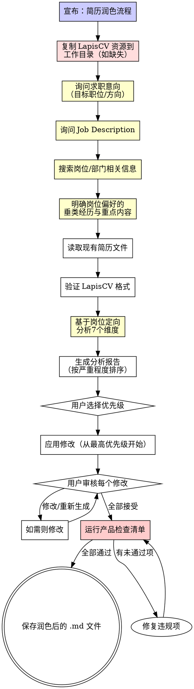

# 简历润色工作流

## 概述

通过岗位定向分析和迭代改进，优化现有简历。

**核心原则：** 先定位岗位，再诊断问题，最后修改。顺序不能颠倒。

**违反流程的字面意思就是违反流程的精神。**

## 铁律

```
没有岗位定位就不能分析。没有分析就不能修改。
```

没有问岗位就改简历？删除修改。重做。
没有分析就开始改写？删除修改。重做。

**无例外：**
- 不要"我觉得这个岗位需要什么"——去问用户
- 不要跳过搜索步骤——网上信息比你的猜测准
- 不要因为"简历看起来还行"就跳过维度
- 不要在不向用户展示分析的情况下应用修改
- 不要在少于2轮审核的情况下输出最终结果

## 流程图



## 阶段1：设置 LapisCV 环境

**如果用户的工作目录已有 `lapis-cv/styles/` 和 `lapis-cv/fonts/`**，跳过此步骤。

**如果没有**，从技能目录复制 LapisCV 资源到用户当前工作目录：

```bash
SKILL_DIR="skills/mokio-interview-skill"
cp -r "${SKILL_DIR}/assets/lapis-cv-vscode-v2.0.1/.vscode" ./
cp -r "${SKILL_DIR}/assets/lapis-cv-vscode-v2.0.1/lapis-cv" ./
cp "${SKILL_DIR}/assets/lapis-cv-vscode-v2.0.1/template-cn.md" ./
cp "${SKILL_DIR}/assets/lapis-cv-vscode-v2.0.1/template-en.md" ./
```

文件必须平铺复制（不放入子目录），因为 `.vscode/settings.json` 使用相对路径如 `./lapis-cv/styles/...`。

## 阶段2：岗位定位

<EXTREMELY-IMPORTANT>
阶段2的四个步骤必须严格按顺序执行。不能跳过。不能合并。不能"我觉得不需要搜索"。
</EXTREMELY-IMPORTANT>

### 步骤1：询问求职意向

向用户询问：

> "你的求职意向是什么？请告诉我目标职位的大致方向，例如：
> - 前端工程师 / 后端工程师 / 全栈工程师
> - 算法工程师（CV / NLP / 推荐系统 / ……）
> - DevOps / SRE / 数据工程师
> - 或其他方向"

**等待用户回复。不要假设。不要跳过。**

### 步骤2：询问 Job Description

向用户询问：

> "请提供目标岗位的 Job Description（职位描述）。你可以：
> - 直接粘贴 JD 文本
> - 提供 JD 链接（我会读取内容）
> - 如果没有具体 JD，描述你了解的岗位要求"

**如果用户没有具体 JD：** 基于步骤1的求职意向，在步骤3中额外搜索该岗位的典型 JD 作为参考。

### 步骤3：搜索岗位/部门相关信息

**必须联网搜索。** 不能凭"我知道这个岗位需要什么"来替代。

搜索内容：

1. **目标岗位的典型技能要求和技术栈** — 搜索"XX工程师 岗位要求 2024/2025"
2. **目标公司的部门信息**（如果用户提到了具体公司）— 搜索公司+部门+技术栈
3. **该岗位的面试重点和常见考察方向** — 搜索"XX工程师 面试重点"

搜索关键词示例：

```
"算法工程师 岗位要求 技能" → 了解岗位核心技能
"字节跳动 推荐算法团队 技术栈" → 了解目标部门技术
"后端工程师 面试 高频考点" → 了解面试重点
```

**搜索结果记录：** 将搜索到的关键信息整理成要点，作为步骤4的输入。

### 步骤4：明确岗位偏好的垂类经历与重点内容

基于步骤1-3收集的信息，**向用户展示你的分析结论并确认**：

```markdown
## 岗位定向分析

**目标岗位：** [从步骤1获取]

**核心关键词：** [从JD和搜索结果提取]

**岗位偏好的垂类经历：**
- [例如：算法岗位偏好有模型训练/微调经历的候选人]
- [例如：后端岗位偏好有高并发系统设计经验的候选人]

**部门重点关注内容：**
- [例如：推荐团队关注特征工程和模型评估]
- [例如：基础架构团队关注性能优化和系统稳定性]

**简历应突出的方向：**
- [基于以上分析，哪些项目/经历应该前置]
- [哪些技术关键词必须出现]

---

这个分析准确吗？有需要补充或修正的吗？
```

**等待用户确认后再继续。** 用户的反馈会修正你的分析方向。

**红旗 —— 停止并重做：**
- 没有询问求职意向就开始分析简历
- 没有询问JD就假设知道岗位要求
- 跳过搜索步骤，凭记忆"知道"岗位需求
- 没有向用户展示岗位分析结论就开始修改简历
- 用户说"你就看着改吧"——仍然要先定位岗位

## 阶段3：读取和验证

### 读取简历

向用户询问简历文件路径。读取整个文件。

**如果文件不存在或无法读取：** 再次询问。不要编造内容。

### 格式验证

检查 LapisCV 格式合规性：

- [ ] `h1` 存在（姓名）
- [ ] `blockquote` 存在（带图标的联系方式）
- [ ] 章节标题使用 `h2` + 图标前缀
- [ ] 条目标题使用 `div alt="entry-title"`
- [ ] 日期格式一致

**如果格式严重损坏：** 告知用户。提供从 `assets/lapis-cv-vscode-v2.0.1/template-cn.md`（或 `template-en.md`）复制模板并迁移其内容后再润色的选项。

## 阶段4：岗位定向七维分析

**分析每个维度时，始终以阶段2的岗位定向分析为参照。** 同一份简历，目标岗位不同，分析结论不同。

**跳过维度 = 不完整的诊断。** 共7个维度。

**红旗 —— 停止并完成分析：**
- "简历看起来还行，我就修修明显的问题"——遗漏系统性弱点
- "我不需要岗位定位也能评估"——关键词和重点完全取决于岗位
- "这个维度看起来没问题我就跳过了"——"看起来没问题" ≠ 验证过没问题
- "我不读项目代码也能评估内容"——格式可以，内容深度不行
- "这个维度不适用于这份简历"——7个维度适用于每份简历
- "我批量修复而不是先分析"——先诊断后开方

### 维度1：量化程度

**检查：** 每个要点是否包含可量化的结果？

| 评级 | 标准 |
|--------|----------|
| 强 | >80% 的要点包含数字（%、数量、时间、规模） |
| 中 | 50-80% 的要点包含数字 |
| 弱 | <50% 的要点包含数字 |

**常见问题：**
- "提升了性能" → 提升了多少？
- "降低了延迟" → 从X降到Y？
- "管理团队" → 多少人？
- "开发了一个功能" → 多少用户？什么规模？

### 维度2：STAR 方法

**检查：** 要点是否遵循情境-任务-行动-结果结构？

| 评级 | 标准 |
|--------|----------|
| 强 | 大部分要点清楚传达了背景、行动和结果 |
| 中 | 要点有行动和部分结果，但缺少背景 |
| 弱 | 要点只列举职责而没有成果 |

**常见问题：**
- 只描述做了什么，没有为什么或结果如何
- 列举职责而非成就
- 缺少"那又怎样？"——为什么这很重要？

### 维度3：关键词覆盖（岗位定向）

**检查：** 简历是否覆盖了阶段2中识别的岗位核心关键词？

**参照阶段2的岗位分析结论**，逐项检查：

1. 岗位核心技能关键词是否出现在简历中？
2. JD 中提到的技术栈是否在项目经历中有体现？
3. 搜索到的岗位高频词是否被覆盖？

**岗位定向评估：**

| 评级 | 标准 |
|--------|----------|
| 强 | >80% 的岗位关键词在简历中有对应经历 |
| 中 | 50-80% 的岗位关键词有对应 |
| 弱 | <50% 的岗位关键词被覆盖 |

**常见问题：**
- 缺少项目代码中使用的技术框架/库名称
- 使用泛泛术语而非具体技术名称
- 专业技能部分与岗位要求不匹配
- 有相关经历但用了模糊描述，未命中关键词

### 维度4：格式一致性

**检查：** LapisCV 格式是否正确且一致？

| 检查项 | 查找内容 |
|-------|-----------------|
| 图标代码 | 所有 `&#xeXXXX;` 代码是否正确 |
| 条目标题 | 是否都包裹在 `div alt="entry-title"` 中 |
| 日期 | 所有条目的日期格式是否一致 |
| 要点样式 | 是否一致使用 `- **加粗**: 内容` |
| 章节顺序 | 逻辑流程（教育 → 工作 → 项目 → 技能） |

### 维度5：冗余和缺失（岗位定向）

**检查：** 是否有不必要的内容？是否有对目标岗位重要的经历缺失？

**冗余信号：**
- 同一技术在不同要点中提及但没有新上下文
- 模糊的软技能（"团队合作"、"努力工作"）占据空间
- 与目标岗位不相关的经历占用过多篇幅
- 不同要点说的是同一件事

**缺失信号（以岗位为参照）：**
- 岗位要求的关键技术在简历中完全没出现
- 有相关项目但未突出与岗位最匹配的部分
- 专业技能部分缺少岗位JD中明确要求的技术
- 未解释的显著时间间隔
- 缺少该岗位级别应有的成就

### 维度6：动词力度

**检查：** 要点是否使用了有力、具体的行动动词？

**需要替换的弱动词：**

| 弱动词 | 强动词替代 |
|------|-------------------|
| 参与了 | 主导、实现、开发、构建 |
| 协助了 | 设计、优化、自动化、架构 |
| 负责了 | 管理、指导、协调、负责 |
| 参与了 | 贡献、推动、牵头 |
| 辅助了 | 促成、支持、保障 |
| 涉及了 | 执行、交付、上线 |

**每个弱动词都必须标记。** 无例外。

### 维度7：项目结构

**检查：** 每个项目条目是否遵循"项目背景 → 解决方案 → 项目成果"结构？

**理想的项目条目结构**（源自高性能技术简历）：

```
## &#xe635; 项目经历

<div alt="entry-title">
    <h3>项目名称</h3>
    <a href="URL">链接</a>
</div>

**项目背景：** 一句话解释问题背景和为什么重要。

**解决方案：** 要点列表，描述你做了什么，包含技术细节和架构决策。

**项目成果：** 量化的结果——指标、改进、交付物。
```

**为什么这个结构有效：**
- **项目背景** 给面试官追问的上下文
- **解决方案** 展示技术深度和个人贡献
- **项目成果** 用证据证明影响

**常见结构问题：**

| 问题 | 示例 | 修复 |
|-------|---------|-----|
| 没有背景 | 直接跳到"实现了X" | 加一句：存在什么问题，为什么重要 |
| 背景和解决方案混在一起 | "系统有延迟问题所以我优化了查询" | 分开："系统 P99 延迟 >800ms"（背景）→ "使用复合索引优化查询"（解决方案） |
| 没有成果 | "使用 Redis 实现了缓存" | 加上："将 P99 延迟从 800ms 降至 120ms" |
| 成果没有上下文 | "性能提升了85%" | 85%的什么？加上基线："响应时间从2分钟降至1分钟" |
| 解决方案列举技术但不解释决策 | "使用了 Redis、Kafka 和 PostgreSQL" | 解释为什么："选择 Redis 做热键缓存而非 Memcached，因为需要持久化" |
| 团队成果没有个人贡献 | "团队构建了支撑1万用户的平台" | 说明你的角色："主导平台后端架构，支撑1万并发用户" |

**"2分钟电梯演讲"测试：** 对每个项目，条目应包含足够信息，使候选人能在2分钟内解释完整链条：
1. 存在什么问题 → 2. 我决定做什么 → 3. 我怎么做的（具体细节）→ 4. 结果如何

如果缺少任何环节，项目条目不完整。

**项目结构的红旗：**
- 项目条目只是技术列表，没有叙述
- 没有区分"团队做了什么"和"我做了什么"
- 成果部分为空或只有模糊声明
- 缺少背景——读者不知道项目为什么存在
- 解决方案描述系统但不描述候选人的具体决策

## 阶段5：分析报告

以严重程度排序的方式展示发现：

```markdown
# 简历分析报告

**目标岗位：** [岗位名称]

## 🔴 严重（优先修复）
- [维度X] 问题描述 — 建议修复方式

## 🟡 重要（其次修复）
- [维度X] 问题描述 — 建议修复方式

## 🟢 轻微（有时间再修）
- [维度X] 问题描述 — 建议修复方式

## 总结
| 维度 | 评级 | 核心发现 |
|-----------|--------|-------------|
| 量化程度 | 弱/中/强 | 一句话总结 |
| STAR 方法 | 弱/中/强 | 一句话总结 |
| 关键词覆盖 | 弱/中/强 | 一句话总结 |
| 格式 | 弱/中/强 | 一句话总结 |
| 冗余/缺失 | 弱/中/强 | 一句话总结 |
| 动词力度 | 弱/中/强 | 一句话总结 |
| 项目结构 | 弱/中/强 | 一句话总结 |
```

**询问用户：**

> "这是你的简历分析。你想让我修复哪些问题？你可以说：
> - **全部** — 从严重到轻微全部修复
> - **严重 + 重要** — 只修复红色和黄色项目
> - **指定项目** — 告诉我哪些（如"修复量化程度和动词力度"）
> - **自定义** — 告诉我你想改什么"

## 阶段6：迭代修复

从最高优先级到最低优先级，逐部分应用修复。

**每个部分修复后，展示：**

> **部分：[名称]**
>
> 修改前：
> ```
> [原始要点]
> ```
>
> 修改后：
> ```
> [修改后的要点]
> ```
>
> **接受** / **修改** / **重新生成**

**不要一次应用所有修复。** 逐个展示每个修改。让用户接受或拒绝。

**修复时以岗位定向分析为指引：**
- 关键词缺失 → 优先补充岗位核心关键词
- 冗余内容 → 优先删除与岗位不相关的内容
- 项目排序 → 与岗位最相关的项目前置
- 技能部分 → 确保覆盖JD中明确要求的技术

## 阶段7：产品检查清单

保存前运行 resume-creation.md 中相同的产品检查清单。

## 导出 PDF

润色后的简历 .md 文件保存后，提示用户如何导出 PDF：

> **简历已保存！** 如需导出 PDF 文档，请按以下步骤操作：
>
> 1. 在 VS Code 扩展商店搜索并安装 **Markdown PDF** 插件
> 2. 在 VS Code 中打开保存的简历 .md 文件
> 3. 右键点击编辑器 → 选择 **Markdown PDF: Export (pdf)**
> 4. PDF 文件将自动生成在同目录下

**注意：** 确保简历 .md 文件与 `lapis-cv/` 和 `.vscode/` 在同一目录，否则样式无法加载。

## 常见借口

| 借口 | 事实 |
|--------|---------|
| "简历看起来还行，我就做点微调" | "看起来还行"隐藏了系统性弱点。分析全部7个维度。 |
| "我不需要问他们目标什么岗位" | 关键词和重点完全取决于岗位。没有岗位定位就是盲改。 |
| "我一次修完，更快" | 对你更快，对用户更差。他们无法一次审核20个修改。 |
| "弱动词是小问题" | 弱动词让每个要点都变弱。每一个都必须标记。 |
| "格式看起来差不多了" | "差不多"会破坏渲染。每个图标代码、每个 div 都必须正确。 |
| "我不读项目代码也能评估简历" | 你能评估格式，不能评估内容深度。可能的话读代码。 |
| "我不搜索也知道岗位要求" | 你的训练数据可能过时。搜索确保信息准确。 |
| "用户没给JD，我跳过这步" | 没有JD时，搜索该岗位的典型JD作为参考。不能跳过。 |
