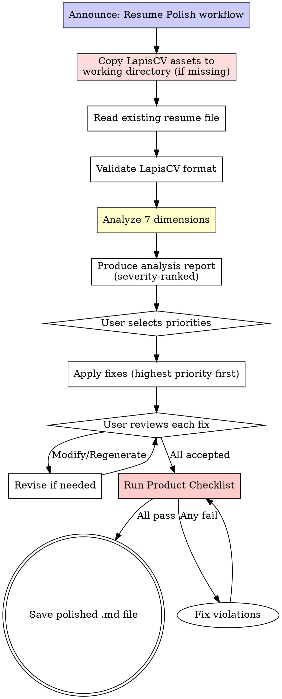

# Resume Polish Workflow

## Overview

Improve an existing resume through systematic seven-dimension analysis and iterative refinement.

**Core principle:** Diagnose before prescribing. Analyze weaknesses first, then prioritize fixes.

**Violating the letter of this process is violating the spirit of this process.**

## The Iron Law

```
NO MODIFICATIONS WITHOUT ANALYSIS FIRST
```

Start rewriting without analyzing? Delete changes. Start over.

**No exceptions:**
- Don't "improve as you go" — analyze everything first
- Don't skip dimensions because "the resume looks fine"
- Don't apply fixes without showing the user the analysis
- Don't produce final output without at least 2 review rounds

## Process Flow



## Phase 1: Setup LapisCV Environment

**If the user's working directory already has `lapis-cv/styles/` and `lapis-cv/fonts/`**, skip this step.

**If not**, copy LapisCV assets from the skill directory into the user's current working directory:

```bash
cp -r "${SKILL_DIR}/assets/lapis-cv-vscode-v2.0.1/.vscode" ./
cp -r "${SKILL_DIR}/assets/lapis-cv-vscode-v2.0.1/lapis-cv" ./
```

Files MUST be copied flat (not into a subdirectory) because `.vscode/settings.json` uses relative paths like `./lapis-cv/styles/...`.

## Phase 2: Read and Validate

### Read the Resume

Ask the user for the resume file path. Read the entire file.

**If the file doesn't exist or can't be read:** Ask again. Don't fabricate content.

### Format Validation

Check LapisCV format compliance:

- [ ] `h1` present (name)
- [ ] `blockquote` present (contact info with icons)
- [ ] Section headers use `h2` + icon prefix
- [ ] Entry titles use `div alt="entry-title"`
- [ ] Date format is consistent

**If format is severely broken:** Tell the user. Offer to restructure by copying from `assets/lapis-cv-vscode-v2.0.1/template-cn.md` (or `template-en.md`) and migrating their content into the template before polishing.

## Phase 2: Six-Dimension Analysis

**Analyze EVERY dimension.** Skipping a dimension = incomplete diagnosis. 7 dimensions total.

**Red Flags — STOP and Complete Analysis:**
- "The resume looks fine, I'll just fix the obvious stuff" — Missing systematic weaknesses
- "I don't need to ask what role they're targeting" — Keywords depend on the role
- "I'll skip this dimension since it seems okay" — "Seems okay" ≠ verified okay
- "I can assess content without reading project code" — Format yes, content depth no
- "This dimension doesn't apply to this resume" — All 6 apply to every resume
- "I'll batch the fixes instead of analyzing first" — Diagnose before prescribing

### Dimension 1: Quantification

**Check:** Does each bullet point include measurable results?

| Rating | Criteria |
|--------|----------|
| Strong | >80% of bullets have numbers (%, count, time, size) |
| Adequate | 50-80% of bullets have numbers |
| Weak | <50% of bullets have numbers |

**Common issues:**
- "Improved performance" → improved by how much?
- "Reduced latency" → from X to Y?
- "Managed a team" → how many people?
- "Built a feature" → how many users? what scale?

### Dimension 2: STAR Method

**Check:** Do bullet points follow Situation-Task-Action-Result structure?

| Rating | Criteria |
|--------|----------|
| Strong | Most bullets clearly convey context, action, and result |
| Adequate | Bullets have action and some result, but lack context |
| Weak | Bullets list duties without outcomes |

**Common issues:**
- Only describes what was done, not why or what resulted
- Lists responsibilities instead of achievements
- Missing the "so what?" — why did this matter?

### Dimension 3: Keyword Coverage

**Check:** Does the resume include keywords from the target role?

**Process:**
1. Ask the user: "What type of role are you targeting? (e.g., Frontend Engineer, Backend Engineer, Full-Stack, DevOps, etc.)"
2. Check for presence of relevant keywords in the resume
3. Identify missing keywords that should appear

**Common issues:**
- Missing framework/library names that are in the project code
- Using generic terms instead of specific technologies
- Skills section doesn't match technologies used in projects

### Dimension 4: Format Consistency

**Check:** Is the LapisCV format correct and consistent?

| Check | What to Look For |
|-------|-----------------|
| Icon codes | All `&#xeXXXX;` codes correct for their purpose |
| Entry titles | All wrapped in `div alt="entry-title"` |
| Dates | Consistent format across all entries |
| Bullet style | Consistent use of `- **Bold**: content` |
| Section order | Logical flow (Education → Work → Projects → Skills) |

### Dimension 5: Redundancy and Gaps

**Check:** Is there unnecessary content? Are important experiences missing?

**Redundancy signals:**
- Same technology mentioned in multiple bullet points without new context
- Vague soft skills ("team player", "hard worker") taking up space
- Outdated or irrelevant experience
- Bullet points that say the same thing differently

**Gap signals:**
- Projects mentioned in work experience but not in Projects section (or vice versa)
- Technologies used in projects but missing from Skills section
- Significant time gaps not explained
- Missing achievements that would be expected for the role level

### Dimension 6: Verb Strength

**Check:** Are bullet points using strong, specific action verbs?

**Weak verbs to replace:**
| Weak | Strong Alternatives |
|------|-------------------|
| Worked on | Led, Implemented, Developed, Built |
| Helped with | Designed, Optimized, Automated, Architected |
| Was responsible for | Managed, Directed, Coordinated, Owned |
| Participated in | Contributed to, Drove, Spearheaded |
| Assisted with | Enabled, Facilitated, Supported |
| Involved in | Executed, Delivered, Shipped |

**Every weak verb MUST be flagged.** No exceptions.

### Dimension 7: Project Structure

**Check:** Does each project entry follow the "Background → Solution → Result" structure?

**The ideal project entry structure** (derived from high-performing technical resumes):

```
## &#xe635; Projects

<div alt="entry-title">
    <h3>Project Name</h3>
    <a href="URL">link</a>
</div>

**Project Background:** One sentence explaining the problem context and why it matters.

**Solution:** Bullet points describing what YOU did, with technical specifics and architecture decisions.

**Result:** Quantified outcomes — metrics, improvements, deliverables.
```

**Why this structure works:**
- **Background** gives the interviewer context for follow-up questions
- **Solution** demonstrates technical depth and personal contribution
- **Result** proves impact with evidence

**Common structural issues:**

| Issue | Example | Fix |
|-------|---------|-----|
| No background | Jumps straight into "Implemented X" | Add one sentence: what problem existed and why it mattered |
| Mixed background and solution | "The system had latency issues so I optimized the query" | Separate: "System had P99 latency >800ms" (background) → "Optimized query with composite indexes" (solution) |
| No results | "Implemented caching with Redis" | Add: "reducing P99 latency from 800ms to 120ms" |
| Results without context | "Improved performance by 85%" | 85% of what? Add baseline: "from 2min to 1min response time" |
| Solution lists technologies without explaining decisions | "Used Redis, Kafka, and PostgreSQL" | Explain WHY: "Chose Redis for hot-key caching over Memcached due to persistence requirements" |
| Group achievements without individual contribution | "Team built a platform handling 10K users" | Clarify YOUR role: "Led backend architecture for a platform handling 10K concurrent users" |

**The "2-minute pitch" test:** For each project, the entry should contain enough information that the candidate could explain the complete chain in 2 minutes:
1. What problem existed → 2. What I decided to do → 3. How I did it (with specifics) → 4. What resulted

If any link is missing, the project entry is incomplete.

**Entry-level vs. experienced distinction:**

For internships and early-career entries, the background may be implicit ("Team project for X course"). For industry experience, the background MUST explain the business context and why the project was needed.

**Red Flags for project structure:**
- Project entry is just a list of technologies with no narrative
- No separation between "what the team did" and "what I did"
- Results section is empty or has only vague claims
- Background is missing — reader doesn't know why the project exists
- Solution describes the system but not the candidate's specific decisions

## Phase 3: Analysis Report

Present findings as a severity-ranked report:

```markdown
# Resume Analysis Report

## 🔴 Critical (Fix First)
- [Dimension X] Issue description — suggested fix

## 🟡 Important (Fix Next)
- [Dimension X] Issue description — suggested fix

## 🟢 Minor (Fix If Time)
- [Dimension X] Issue description — suggested fix

## Summary
| Dimension | Rating | Key Finding |
|-----------|--------|-------------|
| Quantification | Weak/Adequate/Strong | One-line summary |
| STAR Method | Weak/Adequate/Strong | One-line summary |
| Keywords | Weak/Adequate/Strong | One-line summary |
| Format | Weak/Adequate/Strong | One-line summary |
| Redundancy/Gaps | Weak/Adequate/Strong | One-line summary |
| Verb Strength | Weak/Adequate/Strong | One-line summary |
| Project Structure | Weak/Adequate/Strong | One-line summary |
```

**Ask the user:**

> "Here's your resume analysis. Which issues would you like me to fix? You can say:
> - **All** — Fix everything from critical to minor
> - **Critical + Important** — Fix red and yellow items only
> - **Specific items** — Tell me which ones (e.g., 'Fix quantification and verb strength')
> - **Custom** — Tell me what you want changed"

## Phase 4: Iterative Fixes

Apply fixes one section at a time, from highest to lowest priority.

**After each section fix, present:**

> **Section: [Name]**
>
> Before:
> ```
> [original bullet points]
> ```
>
> After:
> ```
> [revised bullet points]
> ```
>
> **Accept** / **Modify** / **Regenerate**

**Do NOT apply all fixes at once.** Show each change. Let the user accept or reject.

## Phase 5: Product Checklist

Run the same Product Checklist from resume-creation.md before saving.

## Common Rationalizations

| Excuse | Reality |
|--------|---------|
| "The resume looks fine, I'll just make a few tweaks" | "Looks fine" hides systematic weaknesses. Analyze all 6 dimensions. |
| "I don't need to ask what role they're targeting" | Keywords depend on the role. You can't assess coverage without knowing the target. |
| "I'll fix everything at once, it's faster" | Faster for you, worse for the user. They can't review 20 changes at once. |
| "Weak verbs are a minor issue" | Weak verbs make every bullet point weaker. Every one must be flagged. |
| "The format looks close enough" | "Close enough" breaks rendering. Every icon code, every div must be correct. |
| "I can assess the resume without reading the project code" | You can assess format, not content depth. Read code when possible. |
